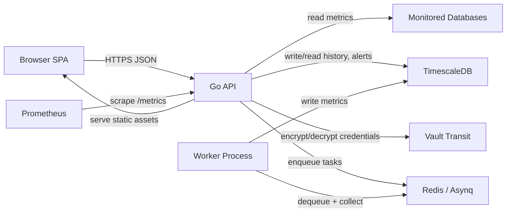

# Architecture

SQL Optima is a Go backend + static SPA frontend, with TimescaleDB for historical dashboards, alert state, and server registry. It supports both PostgreSQL and SQL Server as monitored targets.

## Components

- **Backend (`backend/`)**
  - Gorilla `mux` HTTP API under `/api/*` with role-based middleware (`RequireAuth`, `RequireAnyRole`)
  - Collectors and repositories for SQL Server and PostgreSQL telemetry
  - TimescaleDB writer/reader for historical metrics, alert lifecycle, and server registry
  - **Alert engine** — background evaluators with fingerprint-based dedup, maintenance windows, and audit history; singleton execution via `pg_try_advisory_xact_lock`
  - **EXPLAIN analyzer** (`internal/explain/`) — PostgreSQL plan parser, diagnostics, metrics, rule engine, and report generator
  - **Rules engine** (`internal/ruleengine/`) — best-practice checks for both engines
  - **Worker queue** (optional) — Asynq/Redis for distributed live + historical collection (`internal/queue/`)
  - **Credential encryption** — Vault Transit KMS or local envelope encryption fallback (`internal/security/`)

- **Frontend (`frontend/`)**
  - Static HTML/CSS/JS SPA
  - Calls the backend via `/api/*`

- **Storage**
  - TimescaleDB (Postgres + Timescale extension) for metric snapshots, dashboards, widget registry, alert tables, and server registry
  - Redis (optional) — Asynq task queue for scaled collector deployments

- **External integrations**
  - HashiCorp Vault (optional) — Transit engine for credential encryption at rest
  - Prometheus — `/metrics` endpoint with request counters and duration histograms
  - OpenTelemetry — optional OTLP tracing export

## Data flow

## Key subsystems

### Alert engine
- Evaluators produce alerts with a deterministic SHA-256 fingerprint per rule+instance.
- `INSERT … ON CONFLICT (fingerprint) WHERE status IN ('open','acknowledged')` deduplicates at the DB level.
- A background loop in each API process acquires `pg_try_advisory_xact_lock` so only one replica evaluates per tick.
- Status transitions (open → acknowledged → resolved) are recorded in `optima_alert_history`.

### Authentication & RBAC
- JWT (HS256, 24 h) via `Authorization: Bearer` header or HttpOnly cookie.
- `AuthClaims` carries `UserID`, `Username`, `Role`.
- Middleware: `RequireAuth(secret)` validates tokens; `RequireAnyRole(roles...)` gates endpoints.
- Auth mode: local (bcrypt passwords in TimescaleDB) or OIDC (external provider).

### Credential management
- Server credentials encrypted at rest using Vault Transit (`/transit/encrypt/sql-optima`) when `VAULT_ADDR` is set.
- Falls back to local envelope encryption derived from `JWT_SECRET` when Vault is unavailable.

## Trust boundaries / safety controls

- **Dynamic SQL** (widgets, rules, internal helpers) is constrained by:
  - read-only SQL sandbox (`backend/internal/security/sqlsandbox/`)
  - server-side timeouts
  - row limits
- **Secrets** are expected via environment variables (not committed config files).
- **Logging** uses best-effort redaction (`internal/security/redact/`) to avoid leaking DSNs and secret-like fields.
- **Alert mutations** derive actor identity from JWT claims — no client-supplied actor field is trusted.

For a deeper security view, see `docs/threat_model.md`.

