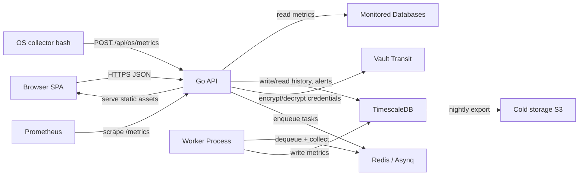

# Architecture

SQL Optima is a Go backend + static SPA frontend, with TimescaleDB for historical dashboards, alert state, and server registry. It supports both PostgreSQL and SQL Server as monitored targets.

## Code Organization

### Backend Repository Layer (Micro-Architecture)

The SQL Server repository (`backend/internal/repository/`) follows Domain-Driven Design (DDD) principles with focused, single-responsibility files:

- **`sqlserver_repository.go`** — Core connection management, pool configuration, instance initialization
- **`sqlserver_status.go`** — Instance status management (online/offline/unknown)
- **`sqlserver_database.go`** — Database listing utilities, bracket quoting helpers
- **`sqlserver_global_metric.go`** — System-level DMVs (CPU, memory ring buffers)
- **`sqlserver_long_running_queries.go`** — Long-running query statistics from `dm_exec_requests`
- **`sqlserver_query_store.go`** — Query Store aggregated statistics
- **`sqlserver_ag_health.go`** — AlwaysOn Availability Group health metrics
- **`sqlserver_database_throughput.go`** — Per-database throughput (index usage, batch requests)
- **`sqlserver_perf_wrapper.go`** — Performance metrics wrapper functions (latches, waits, memory grants, etc.)
- **`sqlserver_storage.go`** — Database and table size metrics
- **`sqlserver_index.go`** — Index usage, fragmentation, and table structure metrics
- **`sqlserver_replication.go`** — Transactional/merge replication status
- **`sqlserver_log_shipping.go`** — Log shipping health monitoring
- **`sqlserver_connection_stats.go`** — Connection statistics by application

This split makes it easier to:
- Debug specific features without navigating a monolithic file
- Add enhancements in focused, isolated files
- Write unit tests per domain area
- Maintain code ownership by feature area

### Domain modules (backup, DR, HA)

Larger features live under `backend/internal/domain/`:

- **`postgres_backup_dr/`** — Backup/DR collectors, Timescale snapshots (`snapshot.pg_backup_dr_timeseries`), DR policy (`optima_server_dr_policy`), readiness APIs
- **`sqlserver_backup_recovery/`** — Backup posture/history collectors, dashboard repository, RPO policy, readiness chips
- **`sqlserver_ha_replication/`** — AG/replication collectors and Timescale writers

### Components

- **Backend (`backend/`)**
  - Gorilla `mux` HTTP API under `/api/*` with role-based middleware (`RequireAuth`, `RequireAnyRole`)
  - Collectors and repositories for SQL Server and PostgreSQL telemetry
  - TimescaleDB writer/reader for historical metrics, alert lifecycle, and server registry
  - **Alert engine** — background evaluators with fingerprint-based dedup, maintenance windows, and audit history; singleton execution via `pg_try_advisory_xact_lock`
  - **EXPLAIN analyzer** (`internal/explain/`) — PostgreSQL plan parser, diagnostics, metrics, rule engine, and report generator
  - **Rules engine** (`internal/ruleengine/`) — signal-aware best-practice checks for both engines using `expr-lang/expr`; OS host context for PostgreSQL via `oscontext` when OS collector data is present
  - **Query V2 Pipeline** (`internal/collectors/domain/`) — hash-based delta tracking computes per-query deltas between collection cycles for SQL Server and PostgreSQL, enabling per-query trend analysis; always enabled at API startup
  - **Intelligence reports** (`internal/intel/`) — Go-native SQL Server health analysis, forecasting, narrative enrichment, HTML templates (v4), optional in-memory cache
  - **OS collector bundle** (`internal/oscollectorbundle/`) — builds UI download zip with pre-filled agent config; ingest toggle in `optima_platform_settings`
  - **API error sanitization** (`internal/apiresponse/`) — stable client-facing errors on selected routes; full errors in `slog` server logs
  - **Worker queue** (optional) — Asynq/Redis for distributed live + historical collection (`internal/queue/`)
  - **Credential encryption** — Vault Transit KMS or local envelope encryption fallback (`internal/security/`)

- **Frontend (`frontend/`)**
  - Static HTML/CSS/JS SPA
  - Calls the backend via `/api/*`

- **OS collector (`os_collector/`)**
  - Bash agent (`sql-optima-os-collector.sh`) on PostgreSQL Linux hosts
  - Pushes to `POST /api/os/metrics` with admin JWT; no Go runtime on DB hosts

- **Storage**
  - TimescaleDB (Postgres + Timescale extension) for metric snapshots, dashboards, widget registry, alert tables, server registry, and `coldstorage.*` export control
  - Redis (optional) — Asynq task queue for scaled collector deployments

- **External integrations**
  - HashiCorp Vault (optional) — Transit engine for credential encryption at rest
  - Prometheus — `/metrics` endpoint with request counters and duration histograms
  - OpenTelemetry — optional OTLP tracing export
  - S3/MinIO (optional) — cold storage Parquet export pipeline

## Data flow

```mermaid
flowchart LR
  Browser[Browser SPA] -->|HTTPS JSON| Api[Go API]
  Api -->|read metrics| TargetDBs[Monitored Databases]
  Api -->|write/read history, alerts| Timescale[TimescaleDB]
  Api -->|encrypt/decrypt credentials| Vault[Vault Transit]
  Api -->|serve static assets| Browser
  OSAgent[OS collector bash] -->|POST /api/os/metrics| Api
  Api -->|enqueue tasks| Redis[Redis / Asynq]
  Worker[Worker Process] -->|dequeue + collect| Redis
  Worker -->|write metrics| Timescale
  Prometheus[Prometheus] -->|scrape /metrics| Api
  Timescale -->|nightly export| Cold[Cold storage S3]
```

## Key subsystems

### Collector engine

The collector engine (`internal/collectors/`) follows a domain-driven architecture:

- `application/collect_cycle.go` — orchestration loop; drives all snapshot collectors on a configurable cadence
- `domain/` — scheduler, rule evaluators, enrichment, sampler, snapshot models; the **Query V2** delta-tracking pipeline lives here
- `infrastructure/sqlserver/` and `infrastructure/timescaledb/` — concrete writers that persist snapshots into TimescaleDB hypertables
- `postgres/` — PostgreSQL-specific snapshot collectors (pg_stat_statements, control center, blocking, index/table usage)

The `pg_stats` module is split into focused single-responsibility collectors (`pg_comprehensive_collector.go`, `pg_snapshot_collector.go`, `pg_locks_blocking/`, etc.) to isolate failures and improve resilience when individual metrics are unavailable.

SQL Server backup collectors (`sqlserver_backup_posture`, `sqlserver_backup_history`) write to `monitor.sqlserver_backup_*` hypertables for the Backup & Recovery dashboard.

### Live vs historical query paths

- **Live dashboards** — API opens a connection to the monitored instance, runs DMV/catalog queries, returns JSON. No Timescale required.
- **Historical dashboards** — Background collectors snapshot into TimescaleDB; API reads hypertables. SQL Server charts default to Timescale; explicit `source=live` opts into DMV fallback when history is empty.

After an **API restart**, in-process delta state resets; allow 1–2 collector cycles before trusting delta-based charts. See [`docs/operations.md`](docs/operations.md).

### Alert engine
- Evaluators produce alerts with a deterministic SHA-256 fingerprint per rule+instance.
- `INSERT … ON CONFLICT (fingerprint) WHERE status IN ('open','acknowledged')` deduplicates at the DB level.
- A background loop in each API process acquires `pg_try_advisory_xact_lock` so only one replica evaluates per tick.
- Status transitions (open → acknowledged → resolved) are recorded in `optima_alert_history`.
- DR policies in `optima_server_dr_policy` feed backup-freshness alert thresholds.

### Authentication & RBAC
- JWT (HS256, 24 h) via `Authorization: Bearer` header or HttpOnly cookie.
- `AuthClaims` carries `UserID`, `Username`, `Role`.
- Middleware: `RequireAuth(secret)` validates tokens; `RequireAnyRole(roles...)` gates endpoints.
- Auth mode: local (bcrypt passwords in TimescaleDB) or OIDC (external provider).
- OS metrics ingest and bundle download require **admin** role; ingest can be toggled from the UI without restart.

### Credential management
- Server credentials encrypted at rest using Vault Transit (`/transit/encrypt/sql-optima`) when `VAULT_ADDR` is set.
- Falls back to local envelope encryption derived from `JWT_SECRET` when Vault is unavailable.

### Schema bootstrap

First-run setup applies scripts in order (`internal/setup/timescale_migrate.go`):

1. `01_timescale_schema.sql` (includes cold storage control tables)
2. `02_rule_engine.sql`
3. `03_additional_pg_rules.sql`
4. `04_alert_engine.sql`
5. `05_os_metrics_collector.sql`
6. `06_seed_data.sql`
7. `07_rule_engine_os_enriched.sql`

## Trust boundaries / safety controls

- **Dynamic SQL** (widgets, rules, internal helpers) is constrained by:
  - read-only SQL sandbox (`backend/internal/security/sqlsandbox/`)
  - server-side timeouts
  - row limits
- **Secrets** are expected via environment variables (not committed config files).
- **Logging** uses best-effort redaction (`internal/security/redact/`) to avoid leaking DSNs and secret-like fields.
- **Alert mutations** derive actor identity from JWT claims — no client-supplied actor field is trusted.
- **Admin diagnostics** return aggregate Timescale row counts only — no connection strings or passwords.

For a deeper security view, see `docs/threat_model.md`.
