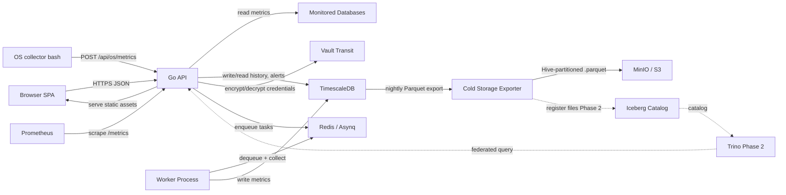

# Architecture

SQL Optima is a Go backend + static SPA frontend, with TimescaleDB for historical dashboards, alert state, and server registry. It supports both PostgreSQL and SQL Server as monitored targets.

## Code Organization

### Backend Repository Layer (Micro-Architecture)

The SQL Server repository (`backend/internal/repository/`) follows Domain-Driven Design (DDD) principles with focused, single-responsibility files:

- **`sqlserver_repository.go`** — Core connection management, pool configuration, instance initialization
- **`sqlserver_status.go`** — Instance status management (online/offline/unknown)
- **`sqlserver_database.go`** — Database listing utilities, bracket quoting helpers
- **`sqlserver_global_metric.go`** — System-level DMVs (CPU, memory ring buffers)
- **`sqlserver_long_running_queries.go`** — Long-running query statistics from `dm_exec_requests`
- **`sqlserver_query_store.go`** — Query Store aggregated statistics
- **`sqlserver_ag_health.go`** — AlwaysOn Availability Group health metrics
- **`sqlserver_database_throughput.go`** — Per-database throughput (index usage, batch requests)
- **`sqlserver_perf_wrapper.go`** — Performance metrics wrapper functions (latches, waits, memory grants, etc.)
- **`sqlserver_storage.go`** — Database and table size metrics
- **`sqlserver_index.go`** — Index usage, fragmentation, and table structure metrics
- **`sqlserver_replication.go`** — Transactional/merge replication status
- **`sqlserver_log_shipping.go`** — Log shipping health monitoring
- **`sqlserver_connection_stats.go`** — Connection statistics by application

This split makes it easier to:
- Debug specific features without navigating a monolithic file
- Add enhancements in focused, isolated files
- Write unit tests per domain area
- Maintain code ownership by feature area

### Domain modules (backup, DR, HA)

Larger features live under `backend/internal/domain/`:

- **`postgres_backup_dr/`** — Backup/DR collectors, Timescale snapshots (`snapshot.pg_backup_dr_timeseries`), DR policy (`optima_server_dr_policy`), readiness APIs
- **`sqlserver_backup_recovery/`** — Backup posture/history collectors, dashboard repository, RPO policy, readiness chips
- **`sqlserver_ha_replication/`** — AG/replication collectors and Timescale writers

### Components

- **Backend (`backend/`)**
  - Gorilla `mux` HTTP API under `/api/*` with role-based middleware (`RequireAuth`, `RequireAnyRole`)
  - Collectors and repositories for SQL Server and PostgreSQL telemetry
  - TimescaleDB writer/reader for historical metrics, alert lifecycle, and server registry
  - **Alert engine** — background evaluators with fingerprint-based dedup, maintenance windows, and audit history; singleton execution via `pg_try_advisory_xact_lock`
  - **EXPLAIN analyzer** (`internal/explain/`) — PostgreSQL plan parser, diagnostics, metrics, rule engine, and report generator
  - **Rules engine** (`internal/ruleengine/`) — signal-aware best-practice checks for both engines using `expr-lang/expr`; OS host context for PostgreSQL via `oscontext` when OS collector data is present
  - **Query V2 Pipeline** (`internal/collectors/domain/`) — hash-based delta tracking computes per-query deltas between collection cycles for SQL Server and PostgreSQL, enabling per-query trend analysis; always enabled at API startup
  - **Intelligence reports** (`internal/intel/`) — Go-native SQL Server health analysis, forecasting, narrative enrichment, HTML templates (v4), optional in-memory cache
  - **OS collector bundle** (`internal/oscollectorbundle/`) — builds UI download zip with pre-filled agent config; ingest toggle in `optima_platform_settings`
  - **API error sanitization** (`internal/apiresponse/`) — stable client-facing errors on selected routes; full errors in `slog` server logs
  - **Worker queue** (optional) — Asynq/Redis for distributed live + historical collection (`internal/queue/`)
  - **Credential encryption** — Vault Transit KMS or local envelope encryption fallback (`internal/security/`)

- **Frontend (`frontend/`)**
  - Static HTML/CSS/JS SPA
  - Calls the backend via `/api/*`

- **OS collector (`os_collector/`)**
  - Bash agent (`sql-optima-os-collector.sh`) on PostgreSQL Linux hosts
  - Pushes to `POST /api/os/metrics` with admin JWT; no Go runtime on DB hosts

- **Storage**
  - TimescaleDB (Postgres + Timescale extension) for metric snapshots, dashboards, widget registry, alert tables, server registry, and `coldstorage.*` export control
  - Redis (optional) — Asynq task queue for scaled collector deployments
  - S3/MinIO (optional) — cold storage Parquet archive (see Cold Storage tier below)

- **External integrations**
  - HashiCorp Vault (optional) — Transit engine for credential encryption at rest
  - Prometheus — `/metrics` endpoint with request counters and duration histograms
  - OpenTelemetry — optional OTLP tracing export
  - MinIO / S3 (optional) — cold storage Parquet export pipeline
  - Apache Iceberg REST catalog (optional, Phase 2) — table catalog for Parquet files; supports Nessie or tabular/iceberg-rest
  - Trino (optional, Phase 2) — federated SQL across TimescaleDB hot tier + cold Parquet tier

## Data flow


```mermaid
flowchart LR
  Browser[Browser SPA] -->|HTTPS JSON| Api[Go API]
  Api -->|read metrics| TargetDBs[Monitored Databases]
  Api -->|write/read history, alerts| Timescale[TimescaleDB]
  Api -->|encrypt/decrypt credentials| Vault[Vault Transit]
  Api -->|serve static assets| Browser
  OSAgent[OS collector bash] -->|POST /api/os/metrics| Api
  Api -->|enqueue tasks| Redis[Redis / Asynq]
  Worker[Worker Process] -->|dequeue + collect| Redis
  Worker -->|write metrics| Timescale
  Prometheus[Prometheus] -->|scrape /metrics| Api
  Timescale -->|nightly Parquet export| Exporter[Cold Storage Exporter]
  Exporter -->|Hive-partitioned .parquet| MinIO[MinIO / S3]
  Exporter -.->|register files Phase 2| Iceberg[Iceberg Catalog]
  Iceberg -.->|catalog| Trino[Trino Phase 2]
  Trino -.->|federated query| Api
```

## Key subsystems

### Collector engine

The collector engine (`internal/collectors/`) follows a domain-driven architecture:

- `application/collect_cycle.go` — orchestration loop; drives all snapshot collectors on a configurable cadence
- `domain/` — scheduler, rule evaluators, enrichment, sampler, snapshot models; the **Query V2** delta-tracking pipeline lives here
- `infrastructure/sqlserver/` and `infrastructure/timescaledb/` — concrete writers that persist snapshots into TimescaleDB hypertables
- `postgres/` — PostgreSQL-specific snapshot collectors (pg_stat_statements, control center, blocking, index/table usage)

The `pg_stats` module is split into focused single-responsibility collectors (`pg_comprehensive_collector.go`, `pg_snapshot_collector.go`, `pg_locks_blocking/`, etc.) to isolate failures and improve resilience when individual metrics are unavailable.

SQL Server backup collectors (`sqlserver_backup_posture`, `sqlserver_backup_history`) write to `monitor.sqlserver_backup_*` hypertables for the Backup & Recovery dashboard.

### Live vs historical query paths

- **Live dashboards** — API opens a connection to the monitored instance, runs DMV/catalog queries, returns JSON. No Timescale required.
- **Historical dashboards** — Background collectors snapshot into TimescaleDB; API reads hypertables. SQL Server charts default to Timescale; explicit `source=live` opts into DMV fallback when history is empty.

After an **API restart**, in-process delta state resets; allow 1–2 collector cycles before trusting delta-based charts. See [`docs/operations.md`](docs/operations.md).

### Alert engine
- Evaluators produce alerts with a deterministic SHA-256 fingerprint per rule+instance.
- `INSERT … ON CONFLICT (fingerprint) WHERE status IN ('open','acknowledged')` deduplicates at the DB level.
- A background loop in each API process acquires `pg_try_advisory_xact_lock` so only one replica evaluates per tick.
- Status transitions (open → acknowledged → resolved) are recorded in `optima_alert_history`.
- DR policies in `optima_server_dr_policy` feed backup-freshness alert thresholds.

### Authentication & RBAC
- JWT (HS256, 24 h) via `Authorization: Bearer` header or HttpOnly cookie.
- `AuthClaims` carries `UserID`, `Username`, `Role`.
- Middleware: `RequireAuth(secret)` validates tokens; `RequireAnyRole(roles...)` gates endpoints.
- Auth mode: local (bcrypt passwords in TimescaleDB) or OIDC (external provider).
- OS metrics ingest and bundle download require **admin** role; ingest can be toggled from the UI without restart.

### Credential management
- Server credentials encrypted at rest using Vault Transit (`/transit/encrypt/sql-optima`) when `VAULT_ADDR` is set.
- Falls back to local envelope encryption derived from `JWT_SECRET` when Vault is unavailable.

### Schema bootstrap

First-run setup applies scripts in order (`internal/setup/timescale_migrate.go`):

1. `01_timescale_schema.sql` (includes cold storage control tables)
2. `02_rule_engine.sql`
3. `03_additional_pg_rules.sql`
4. `04_alert_engine.sql`
5. `05_os_metrics_collector.sql`
6. `06_seed_data.sql`
7. `07_rule_engine_os_enriched.sql`

## Trust boundaries / safety controls

- **Dynamic SQL** (widgets, rules, internal helpers) is constrained by:
  - read-only SQL sandbox (`backend/internal/security/sqlsandbox/`)
  - server-side timeouts
  - row limits
- **Secrets** are expected via environment variables (not committed config files).
- **Logging** uses best-effort redaction (`internal/security/redact/`) to avoid leaking DSNs and secret-like fields.
- **Alert mutations** derive actor identity from JWT claims — no client-supplied actor field is trusted.
- **Admin diagnostics** return aggregate Timescale row counts only — no connection strings or passwords.

For a deeper security view, see `docs/threat_model.md`.

---

## Cold Storage Tier

SQL Optima supports an optional tiered archival pipeline that moves aged TimescaleDB rows to long-term object storage, reducing disk pressure without losing historical data.

### Architecture

```
HOT TIER (TimescaleDB)              COLD TIER (MinIO / S3)
─────────────────────               ──────────────────────
Live dashboards                     Parquet files (Snappy)
90-day retention (core)      →      1–3 year retention
7-day chunk compression             Hive partition layout
Collector writes every minute       Nightly export at 02:00 UTC
```

### Partition Layout

Parquet files land under the configured bucket with a Hive-compatible path:

```
sql-optima-cold/
  metrics/
    engine=sqlserver/
      table=sqlserver_cpu_history/
        server_id=<uuid>/
          year=2025/month=11/day=01/
            part-000001.parquet
    engine=postgres/
      table=postgres_wait_event_stats/
        ...
```

DuckDB and Trino can query this layout with zero additional tooling using `hive_partitioning = true`.

### Go package: `internal/storage/cold/`

| File | Responsibility |
|------|---------------|
| `config.go` | Cold storage env var config; `ExportCutoff()` computes `NOW() - lag_days` |
| `exporter.go` | Orchestrator: reads TimescaleDB → writes Parquet → uploads to S3; 8-worker concurrent pool; atomic `.tmp` → rename write |
| `s3uploader.go` | S3/MinIO upload via `aws-sdk-go-v2/feature/s3/manager` (multipart for large files) |
| `watermark.go` | Tracks `last_exported_at` per (table, server) in `coldstorage.watermarks`; never advances on failure |
| `iceberg.go` | Phase 2: Iceberg REST catalog registration after S3 upload |
| `registration.go` | Dispatcher that calls all domain registration functions |
| `registration_sqlserver_core.go` | CPU, wait, metrics, connection, lock exports |
| `registration_sqlserver_storage.go` | Memory history, memory metrics, disk, throughput, buffer pool |
| `registration_sqlserver_ha.go` | AG health, risk health, AG cluster info |
| `registration_sqlserver_queries.go` | Long-running queries, procedure stats, buffer pool, scheduler |
| `registration_sqlserver_advanced.go` | Query Store, latches, spinlocks, memory grant waiters |
| `registration_postgres.go` | Wait events, IO stats, pgss delta, query wait profile |
| `registration_postgres_activity.go` | Session activity, wait summary, DB load, DDL, backup, roles |
| `registration_system.go` | SQL Server jobs, PG settings/roles, collector runs |

### Schema: `coldstorage` namespace in TimescaleDB

```sql
coldstorage.watermarks   -- one row per (table_name, server_id), tracks last_exported_at
coldstorage.runs         -- hypertable audit log; each export cycle writes one row
coldstorage.status_view  -- JOIN of watermarks + optima_servers; shows age and lag
```

### Registered Tables (36 total)

**Group A — 90-day hot retention** (core metrics, archive to cold):
`sqlserver_cpu_history`, `sqlserver_memory_history`, `sqlserver_wait_history`, `sqlserver_metrics`, `sqlserver_connection_history`, `sqlserver_lock_history`, `sqlserver_disk_history`, `sqlserver_database_throughput`, `sqlserver_memory_metrics`, `sqlserver_buffer_pool_db`, `sqlserver_cpu_scheduler_stats`, `postgres_settings_snapshot`, `monitor.pg_backup_archiver_ts`, `monitor.pg_basebackup_history`, `monitor.pg_roles_snapshot`, `monitor.pg_failed_login_events`

**Group B — 30-day hot retention** (operational, archive selectively):
`sqlserver_ag_health`, `sqlserver_risk_health`, `sqlserver_long_running_queries`, `sqlserver_latch_waits`, `sqlserver_waiting_tasks`, `sqlserver_procedure_stats`, `sqlserver_spinlock_stats`, `sqlserver_memory_grant_waiters`, `postgres_wait_event_stats`, `postgres_db_io_stats`, `monitor.pg_session_activity_ts`, `monitor.pg_wait_event_summary_ts`, `monitor.pg_db_load_ts`, `monitor.pg_query_wait_profile_ts`, `monitor.pg_ddl_activity_ts`

**Not archived** (Group C — 7-day transient staging tables):
`staging.sqlserver_session_request_raw`, `staging.*_raw`, `monitor.pg_incident_feed_ts`, `sqlserver_tempdb_consumers`

### Safety Mechanisms

- **Watermark-gated export**: data is re-exported on retry if upload fails (at-least-once semantics)
- **Chunk compression gate**: exporter checks `timescaledb_information.chunks.is_compressed` before reading a day's data; skips uncompressed windows (configurable via `SkipCompressionCheck` on event tables)
- **Atomic staging**: writes to `*.parquet.tmp` then renames; orphaned `.tmp` files are cleaned on startup
- **Safety purge**: `Exporter.Purge()` drops TimescaleDB chunks only if every server's watermark covers the window — no purge if any server is behind
- **Context-aware scheduler**: uses `select { case <-ctx.Done(): case <-ticker.C: }` for clean shutdown

### Configuration Environment Variables

| Variable | Default | Purpose |
|----------|---------|---------|
| `COLD_STORAGE_ENABLED` | `false` | Enable the export pipeline |
| `COLD_STORAGE_ENDPOINT` | `http://minio:9000` | S3-compatible endpoint |
| `COLD_STORAGE_BUCKET` | `sql-optima-cold` | Target bucket |
| `COLD_STORAGE_ACCESS_KEY_ID` | — | Access key (MinIO root user) |
| `COLD_STORAGE_SECRET_ACCESS_KEY` | — | Secret key |
| `COLD_STORAGE_FORCE_PATH_STYLE` | `true` | Required for MinIO; set `false` for AWS S3 |
| `COLD_STORAGE_LAG_DAYS` | `2` | Days behind today for export cutoff (ensures chunks are compressed) |
| `COLD_STORAGE_BATCH_SIZE` | `50000` | Rows per DB fetch |
| `COLD_STORAGE_PURGE_RETENTION_DAYS` | `30` | Days of hot data to retain after archival; `0` disables purge |
| `COLD_STORAGE_CATALOG_URL` | — | Iceberg REST catalog URL (Phase 2; leave empty for Phase 1) |
| `COLD_STORAGE_TRINO_URL` | — | Trino JDBC URL for federated queries (Phase 2) |
| `COLD_STORAGE_STAGING_DIR` | `/tmp/sql-optima-cold-staging` | Local temp dir for Parquet staging files |

### Docker Compose Profiles

The `cold-storage` compose profile starts MinIO, minio-init (bucket creation), Nessie (Iceberg catalog), and Trino:

```bash
# Start full cold storage stack
COMPOSE_PROFILES=cold-storage docker compose up -d

# MinIO console: http://localhost:9001
# Nessie catalog: http://localhost:19120
# Trino UI:       http://localhost:8081
```

### API Endpoints

| Method | Path | Description |
|--------|------|-------------|
| `GET` | `/api/cold-storage/status` | Watermark status for all tables and servers |
| `GET` | `/api/cold-storage/runs` | Export run history with row/byte counts |
| `POST` | `/api/cold-storage/query` | Execute a read-only SQL query via Trino (requires `COLD_STORAGE_TRINO_URL`) |

`GET /api/config` also exposes `cold_storage_enabled`, `cold_storage_query_available`, and `max_dashboard_range_days` (7 or 90) so the SPA can unlock extended time presets.

### Phase Roadmap

| Phase | Status | Description |
|-------|--------|-------------|
| Phase 1 — S3 export | ✅ Complete | Parquet export to MinIO/S3 with watermarks, compression check, audit log |
| Phase 2 — Iceberg + Trino | ✅ Complete | Iceberg REST catalog registration; Trino federated query endpoint |
| Phase 3 — Frontend time picker | ✅ Complete | Extended presets (30d/90d) + API lookback up to 90 days when `COLD_STORAGE_ENABLED=true` |
| Post-validation — retention reduction | 📄 Opt-in script | Run `migrations/011_cold_storage_reduce_hot_retention_60d.sql` only after 2+ weeks of validated exports (not auto-applied) |
| Phase 4 — Federated dashboard reads | 🚧 Foundation | `internal/storage/cold/federation` helpers (split hot/cold ranges, safe Iceberg names); wire per-handler incrementally via Trino |

### Ad-hoc DuckDB Queries

DuckDB can query cold Parquet files directly from MinIO without any catalog:

```sql
INSTALL httpfs; LOAD httpfs;
SET s3_endpoint='localhost:9000';
SET s3_access_key_id='sqloptima';
SET s3_secret_access_key='change_me_in_production';
SET s3_use_ssl=false;
SET s3_url_style='path';

-- All CPU history for a server
SELECT to_timestamp(capture_timestamp_ms / 1000.0) AS ts, sql_cpu_utilization
FROM read_parquet(
    's3://sql-optima-cold/metrics/engine=sqlserver/table=sqlserver_cpu_history/**/*.parquet',
    hive_partitioning = true
)
WHERE server_id = '<uuid>'
ORDER BY ts;
```

See `infrastructure/sql_scripts/Test_scripts/07_cold_storage_duckdb_validation.sql` for the full validation query suite.
