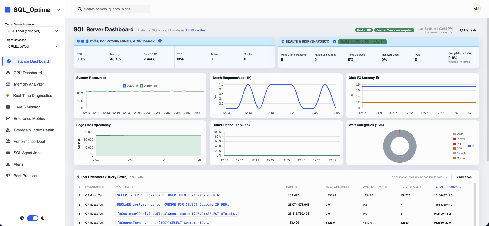
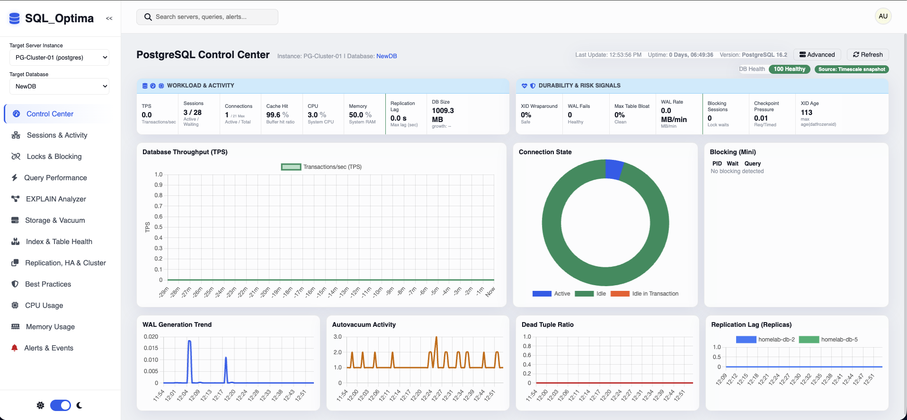

# DB Monitor Pro

A production-grade, highly scalable, dual-engine (PostgreSQL & SQL Server) database monitoring Single Page Application (SPA). This system has been explicitly architected around Domain-Driven Design (DDD) to be 100% platform-independent, natively supporting **Windows**, **macOS**, and **Linux** identically.

---

## 🖥️ UI Preview (Screenshots)
Add these screenshots before publishing to GitHub (recommended size: 1400–2000px wide):

- **SQL Server main dashboard**: `docs/screenshots/sqlserver-dashboard.png`
- **PostgreSQL main dashboard**: `docs/screenshots/postgres-dashboard.png`

After adding, this README will render them here:





## 🚀 Option 1: Running Everything with Docker Compose (Easiest)
Use this option to spin up the entire application (Go Backend API + NGINX Frontend) instantly in isolated containers.

### Execution Steps:
1. Ensure you have [Docker Desktop](https://www.docker.com/products/docker-desktop/) or Docker Engine installed.
2. Place the **`pg_explain_analyze`** module next to **`sql_monitoring_UI`** under the same parent folder (see `replace` in `backend/go.mod`). The Docker build runs `go mod download` and does **not** use a committed `vendor/` tree. For offline local builds only, you may run `cd backend && go mod vendor` (the `vendor/` directory is gitignored).
3. From the **`sql_monitoring_UI`** directory, run:
   ```bash
   docker-compose -f docker/docker-compose.yml up --build -d
   ```
4. Access the web dashboard at `http://localhost:3000` (Nginx) or `http://localhost:8080` (Go API + static UI).

---

## 🛠️ Option 2: Run Postgres/TimescaleDB via Docker & Start Server Manually
Use this option to quickly spin up the backend's persistent data storage (TimescaleDB) via Docker while compiling and running the Go API manually on your local host for active development.

### Phase 1: Start the PostgreSQL Infrastructure
1. Navigate to the infrastructure folder and set up your initial credentials:
   ```bash
   cd infrastructure
   cp docker/.env.example docker/.env
   # Edit infrastructure/docker/.env to assign a secure DB_USER and DB_PASSWORD
   ```
2. Start the isolated TimescaleDB (and Backup Sidecar) engines:
   ```bash
   docker-compose -f docker/docker-compose.yml up -d
   ```
3. Verify the database started properly:
   ```bash
   docker logs dbmonitor_timescaledb
   ```

### Phase 2: Start the Go Backend Server
Ensure you have [Go 1.25+](https://go.dev/dl/) installed.
1. Navigate back to the application's backend directory:
   ```bash
   cd ../backend
   ```
2. Download dependencies exactly once:
   ```bash
   go mod tidy
   ```
3. Launch the Application API Engine:
   ```bash
   # Add your target environment variables here (see SECRETS below)
   go run cmd/server/main.go
   ```
4. View the raw operational Dashboard live at `http://localhost:8080`.

### Phase 3: Stopping the Local Storage Sandbox
When you finish testing and want to spin down your containerized TimescaleDB gracefully without losing persistent metrics:
1. Navigate back to the infrastructure folder and stop the compose network:
   ```bash
   cd ../infrastructure
   docker-compose -f docker/docker-compose.yml down
   ```
*(If deploying the entire suite via **Option 1**, you can simply run `docker-compose -f docker/docker-compose.yml down` directly from the repository root).*

---

### Option 3: Using a Dedicated PostgreSQL/TimescaleDB Server (No Docker!)
If you already maintain a dedicated PostgreSQL server locally or remotely and prefer **not** to use Docker for the metric storage backend, you can configure the app to connect directly to it!

> [!IMPORTANT]
> Your dedicated PostgreSQL server **must** have the [TimescaleDB extension installed](https://docs.timescale.com/install/latest/). 

#### Step 1: Initialize Your Schema
Connect to your dedicated PostgreSQL server as a superuser. You must manually execute the initialization scripts against your database:
```bash
# 1. Create the database, user, and extension
psql -h <your_host> -U postgres -f infrastructure/docker/init-scripts/01_init.sql

# 2. Build the metric tables and hypertables
psql -h <your_host> -U dbmonitor_user -d dbmonitor_metrics -f infrastructure/docker/init-scripts/02_timeseries_schema.sql
```

#### Step 2: Configure Environment & Run
When starting the Go backend, strictly define the TimescaleDB routing environment variables so it points to your dedicated host instead of assuming `localhost:5433`:
```bash
cd backend

# Point to your dedicated database user export for Mac/Linux
export TIMESCALEDB_HOST="your_dedicated_ip_or_hostname"
export TIMESCALEDB_PORT="5432"
export DB_USER="dbmonitor_user"
export DB_PASSWORD="your_secure_password"
export DB_NAME="dbmonitor_metrics"
export TIMESCALEDB_SSLMODE="disable" # Switch to 'require' for secure remote TLS

# use the same variables for Windows PowerShell
$env:TIMESCALEDB_HOST="your_dedicated_ip_or_hostname"
$env:TIMESCALEDB_PORT="5432"
$env:DB_USER="dbmonitor"
$env:DB_PASSWORD="your_secure_password"
$env:DB_NAME="dbmonitor_metrics"
$env:TIMESCALEDB_SSLMODE="disable" # Switch to 'require' for secure remote TLS

# (Also export your target monitored credential variables here as usual)

# Launch the Application
go run cmd/server/main.go
```

---

## ⚙️ Configuration & Adding Database Credentials

The system coordinates parameters through your master `config.yaml` file natively at the repository root. Setting up servers is a two-step process to ensure passwords remain uncommitted and secure.

### 1. Update `config.yaml`
Add your target PostgreSQL and SQL Server details to `config.yaml`.
```yaml
instances:
  - name: "SQL-Prod-Primary"
    type: "sqlserver"
    host: "10.0.1.15"
    port: 1433
    databases: ["AppDB_Prod"]

  - name: "PG-Cluster-01"
    type: "postgres"
    host: "10.0.5.21"
    port: 5432
    databases: ["users_db"]
```

### 2. Supply Secure Passwords (Environment Variables)
> [!IMPORTANT]
> **Do not store passwords in plaintext inside `config.yaml`.** 

The system automatically resolves environment variables to connect to these servers using a strict `DB_<INSTANCE_NAME>_USER` dynamic mapping structure (this maps instance names precisely to uppercase and replaces hyphens metrics with underscores `_`).

**For Mac/Linux:**
```bash
export DB_SQL_PROD_PRIMARY_USER="dbmonitor_admin"
export DB_SQL_PROD_PRIMARY_PASSWORD="SuperSecretPassword!"

export DB_PG_CLUSTER_01_USER="postgres_admin"
export DB_PG_CLUSTER_01_PASSWORD="StrongPGPassword123"

# Start the server afterward
go run cmd/server/main.go
```

**For Windows (PowerShell):**
```powershell
$env:DB_SQL_PROD_PRIMARY_USER="dbmonitor_admin"
$env:DB_SQL_PROD_PRIMARY_PASSWORD="SuperSecretPassword!"

go run .\cmd\server\main.go
```

If utilizing **Option 1 (Docker Compose Everything)**, you can inject these direct environment overrides directly into your `.env` shell so the containerized application can naturally assume them at runtime.

---

## 📦 Build & run as a standalone executable (no “go run”)
You can build a single backend binary that serves both the **API** and the **SPA UI** (static assets) so you don’t need to `cd backend` each time.

### Build
From the repo root:

```bash
cd backend
go test ./...
go build -o ../dist/sql-optima ./cmd/server
```

This produces: `dist/sql-optima`

### Run (from anywhere)
```bash
export JWT_SECRET="change-this"
export TIMESCALEDB_HOST="localhost"
export TIMESCALEDB_PORT="5432"
export DB_USER="dbmonitor"
export DB_PASSWORD="your_password"
export DB_NAME="dbmonitor_metrics"

# Monitored instance credentials:
export DB_SQL_PROD_01_USER="..."
export DB_SQL_PROD_01_PASSWORD="..."
export DB_PG_CLUSTER_01_USER="..."
export DB_PG_CLUSTER_01_PASSWORD="..."

./dist/sql-optima
```

Open:
- UI + API: `http://localhost:8080`

### Optional: put it on your PATH
macOS/Linux:

```bash
sudo install -m 0755 dist/sql-optima /usr/local/bin/sql-optima
sql-optima
```

Windows (PowerShell):

```powershell
# Example: copy to a folder in PATH (or add it)
Copy-Item .\\dist\\sql-optima.exe $env:USERPROFILE\\bin\\sql-optima.exe
```

### Notes
- The binary serves UI assets from `frontend/`. If you move the binary elsewhere, keep the `frontend/` folder next to it or set the environment variable(s) supported by `config.ResolveDataPaths()` to point at the UI directory.
- For Docker deployments, prefer the provided Compose setup.

---

## ✨ Recent UI enhancements
- **EXPLAIN Plan analyzer**: SSMS-style horizontal plan map, hover tooltips, per-edge thickness by row flow, and modal node details.
- **SQL Insights**: always shows provided SQL; improved index DDL suggestions (schema-qualified tables + more condition sources).
- **Optimization report**: now summarizes SQL-linked hints (matched excerpts + index DDL counts).
- **Postgres Control Center**: added **DB Size + growth/hr** strip metric.
- **SQL Server Performance Debt**: de-duplicated “latest per finding” so repeated recommendations don’t show twice.
- **Postgres Advanced Enterprise Monitor**: BGWriter/Checkpoint dedupe + compact trend chart with a smaller table.

---

## 🛡️ Target Database Setup Scripts
In order for DB Monitor Pro to capture system telemetry efficiently, you must provision specialized system-level monitoring roles. Setup scripts have been shipped for this explicitly.

### SQL Server Role Setup
```powershell
sqlcmd -S <server> -i infrastructure\scripts\sqlserver\setup_dbmonitor_user.sql
```

### PostgreSQL Role Setup
```bash
psql -U postgres -f infrastructure/scripts/postgres/setup_dbmonitor_user.sql
# Then, grant permissions inside each distinct database manually
psql -U postgres -d <target_db> -c "SELECT grant_db_permissions();"
```

---

## Documentation map

- **[project_details.md](./project_details.md)** — End-to-end application flow (backend handlers, SPA boot, **route → view** table for every dashboard, sidebar behavior, optional/unused pages).

---

## Recent security and UX fixes

- **SPA router**: Route IDs are validated before navigation (alphanumeric + hyphens, max length) to avoid odd or unsafe values. Unknown routes show an explicit **Page not found** screen instead of loading the SQL Server dashboard by mistake.
- **XSS hardening**: Error paths that write to `innerHTML` use `window.escapeHtml` (e.g. router catch blocks, MSSQL dashboard and locks drilldown, jobs rendering errors). Sidebar highlighting compares `data-route` attributes instead of building a dynamic CSS selector from the route string.
- **Auth navigation**: `login` and `incidents` routes are registered in the router (`incidents` opens the same view as **Alerts**, matching Reports shortcuts).
- **Initial sidebar**: `index.html` shows only **Global Estate** until an instance is selected, matching runtime behavior and avoiding dead links before config loads.

---

## Security operations checklist

1. **JWT**: Set `JWT_SECRET` to a long random value in any shared or production environment. The server logs a warning if it falls back to the development default.
2. **API exposure**: Many read-only monitoring endpoints are **public** on the API router (same pattern as typical internal dashboards). Restrict access with network policy, VPN, or an authenticating reverse proxy if the API is Internet-facing.
3. **Secrets**: Keep database passwords in environment variables, not in `config.yaml` (see above).
4. **Login**: `POST /api/login` and `POST /api/auth/login` are the same rate-limited implementation (`AuthHandlers.Login`). Use either from API clients; the SPA uses `/api/login`.

---

## PostgreSQL and MSSQL UI (snapshot)

- **PostgreSQL**: Control Center, sessions, locks, queries, storage, replication/HA, best-practices (with rules engine + PG-specific API where applicable), CPU/memory, alerts. Optional routes: `pg-config`, `pg-cnpg`, `dynamic-dashboard` (see `project_details.md`).
- **SQL Server**: Instance dashboard, CPU dashboard, live diagnostics, HA/AG, enterprise metrics, performance debt, agent jobs, alerts, best practices; drilldowns for CPU, queries, bottlenecks, growth, indexes, locks, deadlocks.
- **Replication (PG)**: Standby and replication slot tables use a responsive **CSS grid** layout so headers and rows stay aligned on narrow viewports.
