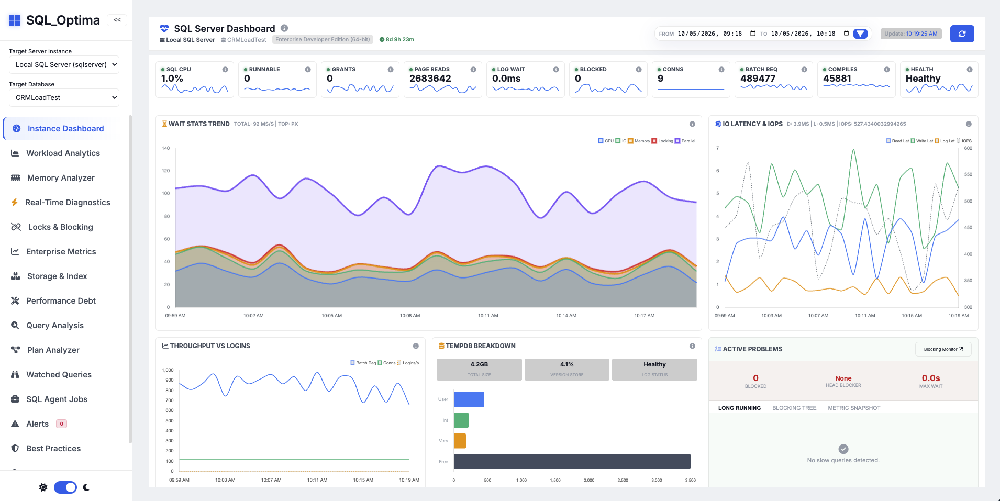
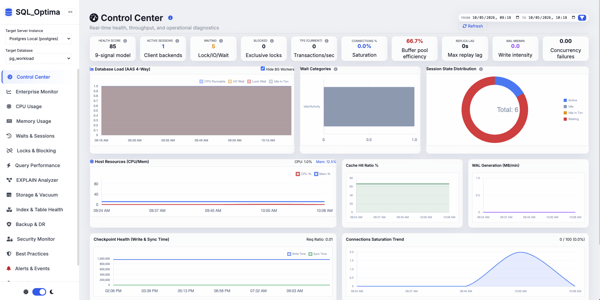
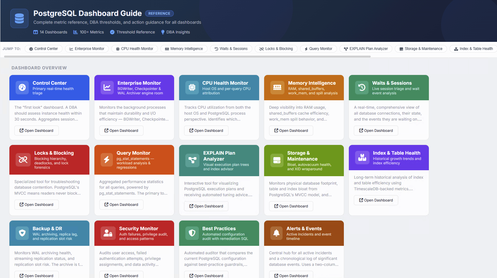
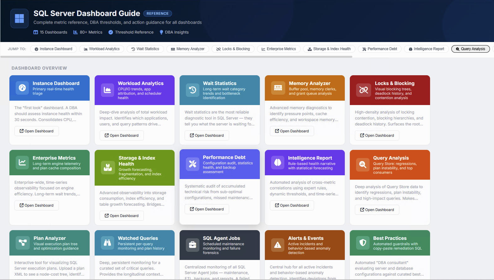
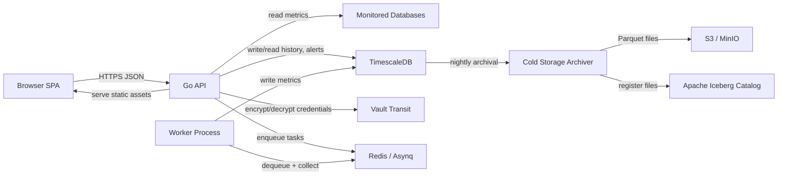

# SQL Optima

**The Open-Source SQL Tuning Assistant & Monitoring Platform for PostgreSQL and SQL Server.**

SQL Optima is a self-hosted, performance-focused monitoring platform built with **Go** and **Vanilla JavaScript**. Designed for DBAs, SREs, and consultants who need more than charts, it encodes expert database knowledge into automated diagnostics so you can not only *see* problems, but *fix* them.

---

## UI preview

Screenshots live in [`docs/screenshots/`](docs/screenshots/). For the full in-app metric reference (all dashboard pages per engine), see **[Dashboard guides](#dashboard-guides)** below.


*SQL Server Instance Dashboard — live DMV metrics, wait trends, and health triage.*


*PostgreSQL EXPLAIN plan analyzer with optimization recommendations.*

---

## Dashboard guides

After you register a server, use the in-app **Dashboard Info** pages for a full tour of every monitoring screen: what each dashboard shows, which metrics matter, DBA healthy/warning/critical thresholds, and copy-paste remediation tips.

**In the app:** select a PostgreSQL or SQL Server instance in the sidebar, then open **Dashboard Info** (book icon, at the bottom of that engine’s menu). Each card links to the live dashboard; a floating **Back to Dashboard Guide** button returns you to the reference page.

| Engine | Dashboards | Metrics covered | In-app route |
|--------|------------|-----------------|--------------|
| PostgreSQL | **14** | 100+ with threshold reference | **Dashboard Info** under PostgreSQL |
| SQL Server | **16** | 80+ with threshold reference | **Dashboard Info** under SQL Server |

### PostgreSQL — 14 dashboards


*In-app PostgreSQL Dashboard Guide — overview of all PG screens, metrics, and DBA thresholds.*

| Dashboard | Purpose |
|-----------|---------|
| **Control Center** | First-look triage: sessions, cache hit ratio, waits, replica lag, and bloat risk in one pane. |
| **Enterprise Monitor** | BGWriter, checkpointer, and WAL archiver health; temp spill and config drift. |
| **CPU Health Monitor** | Host and PostgreSQL CPU; per-database/query attribution and bloat-driven CPU waste. |
| **Memory Intelligence** | RAM, `shared_buffers`, `work_mem`, swap, and temp-file spill analysis. |
| **Waits & Sessions** | Live `pg_stat_activity` triage — state, duration, and wait-event breakdown. |
| **Locks & Blocking** | Blocking chains, deadlocks, and lock forensics (MVCC-aware). |
| **Query Monitor** | `pg_stat_statements` workload, regressions, latency, and WAL-per-execution. |
| **EXPLAIN Plan Analyzer** | Visual plan trees, row-estimate errors, and index recommendations. |
| **Storage & Maintenance** | Bloat, autovacuum health, XID age, and unused indexes. |
| **Index & Table Health** | Historical index vs seq scan ratios, growth, and efficiency (Timescale-backed). |
| **Backup & DR** | WAL archiving, replication lag, and replication-slot retention risk. |
| **Security Monitor** | Failed logins, superuser/role audit, and privilege anomalies. |
| **Best Practices** | Configuration audit against DBA guardrails with remediation SQL. |
| **Alerts & Events** | Open incidents, event timeline, and repeat-incident patterns. |

### SQL Server — 16 dashboards


*In-app SQL Server Dashboard Guide — overview of all SQL Server screens, metrics, and DBA thresholds.*

| Dashboard | Purpose |
|-----------|---------|
| **Instance Dashboard** | First-look triage: CPU, memory, I/O, blocking, waits, and top offenders (live DMVs). |
| **Workload Analytics** | CPU/IO trends, app/user attribution, scheduler pressure, and compilation rates. |
| **Wait Statistics** | Long-term wait-category trends — PAGEIOLATCH, locking, CPU, log I/O, network. |
| **Memory Analyzer** | Buffer pool, memory clerks, grant queue, PLE, and plan-cache composition. |
| **Locks & Blocking** | Blocking trees, root blockers, deadlock XML, and contention forensics. |
| **Enterprise Metrics** | Engine telemetry over time: compilations, plan cache, TempDB, latch trends. |
| **Storage & Index Health** | Growth forecasting, fragmentation, index read/write ratios, reclaimable space. |
| **Performance Debt** | MAXDOP, memory caps, statistics health, backup SLA, and risky settings. |
| **Backup & Recovery** | `msdb` posture/history, RPO policy, readiness chips, and backup SLA triage. |
| **Intelligence Report** | Rule-based health narrative, risk scoring, and statistical forecasting. |
| **Query Analysis** | Query Store regressions, plan instability, and top CPU consumers. |
| **Plan Analyzer** | Interactive execution-plan trees and optimization guidance. |
| **Watched Queries** | Curated per-query monitoring with duration and plan-change history. |
| **SQL Agent Jobs** | Job success/failure, overlap risk, and maintenance-window forensics. |
| **Alerts & Events** | Active incidents, behavioral anomalies, and severity escalation. |
| **Best Practices** | Automated configuration audit with copy-paste remediation SQL. |

Each guide card in the app expands with **key metrics** (healthy / warning / critical bands) and **DBA insights** for that screen. Use it alongside [docs/QUICKSTART.md](docs/QUICKSTART.md) after your first server is registered.

---

## Table of contents

- [UI preview](#ui-preview)
- [Dashboard guides](#dashboard-guides)
- [Getting started](#getting-started)
- [Verify your installation](#verify-your-installation)
- [Documentation](#documentation)
- [Why SQL Optima?](#why-sql-optima)
- [Deployment options](#deployment-options)
- [Target database setup](#target-database-setup)
- [Build binaries](#build-binaries)
- [Architecture](#architecture-overview)
- [Repository layout](#repository-layout)
- [Feature highlights](#feature-highlights)

---

## Getting started

Full walkthrough: **[docs/QUICKSTART.md](docs/QUICKSTART.md)** (development path first, then production).

### Development — quick test (one command)

No editing of `JWT_SECRET`, database passwords, or `.env` files. Docker provisions TimescaleDB, Vault, and schema; the install script waits for the API and opens your browser.

**Requirements:** [Docker Desktop](https://www.docker.com/products/docker-desktop/) or Docker Engine + Compose V2, and Git (or a [release zip](https://github.com/rsharma155/sql_optima/releases)).

**macOS / Linux** (from any directory — clones into `./sql_optima` if needed):

```bash
curl -fsSL https://raw.githubusercontent.com/rsharma155/sql_optima/main/install.sh | bash
# Or, if you already cloned the repo:
./install.sh
```

**Windows (PowerShell)**

```powershell
irm https://raw.githubusercontent.com/rsharma155/sql_optima/main/install.ps1 | iex
# Or from a cloned repo:
PowerShell -ExecutionPolicy Bypass -File .\install.ps1
```

Skip opening the browser: `./install.sh --no-browser` or `.\install.ps1 -NoBrowser`.

**Alternate** (already in the repo): `cd docker && ./start-dev.sh` (macOS/Linux) or `.\start-dev.ps1` (Windows).

Then at **[http://localhost:8080](http://localhost:8080)**:

1. **Setup wizard** — choose admin username and password (browser only; no CLI).
2. **Add monitored databases** — register PostgreSQL or SQL Server (or follow the in-app **local HA setup guide** if you have no database yet).

**What starts automatically**

| Service | Purpose |
|---------|---------|
| **api** | Go backend + SPA on port **8080** |
| **timescaledb** | TimescaleDB (PostgreSQL 16) for metrics and registry |
| **vault** | HashiCorp Vault — Transit KMS for credential encryption |
| **vault-setup** | One-shot: enables Transit and creates the encryption key |
| **schema-setup** | One-shot: applies schema, rules, alerts, and seed data |

```bash
docker compose down      # stop, keep data
docker compose down -v   # stop and wipe volumes (fresh install)
```

**No databases yet?** Use the [local HA test cluster](docs/QUICKSTART.md#local-test-environment-ha-clusters-for-development) companion repo.

### Production — hardened install

For shared or internet-facing deployments, use production defaults from `docker/.env.example`:

```bash
cd sql_optima/docker
cp .env.example .env
# Edit .env: JWT_SECRET, DB_PASSWORD; keep AUTH_REQUIRED=1 and DISABLE_PUBLIC_SETUP=1
docker compose up --build -d
cd ../backend
NEW_ADMIN_PASSWORD='YourStrongPassword8+' go run reset_password.go
```

Sign in as **`admin`**, then add servers from **Admin**. See [QUICKSTART → Production](docs/QUICKSTART.md#production--hardened-deployment), [docs/vault_production.md](docs/vault_production.md), and [SECURITY.md](SECURITY.md).

### Choose a deployment path

| Goal | Guide |
|------|--------|
| Try SQL Optima locally in ~5 minutes | **[docs/QUICKSTART.md](docs/QUICKSTART.md)** → Development |
| Production / shared network | **[QUICKSTART → Production](docs/QUICKSTART.md#production--hardened-deployment)** |
| Kubernetes (Helm) | **[deploy/helm/sql-optima/README.md](deploy/helm/sql-optima/README.md)** |
| Local PG + SQL Server HA + load generator | **[QUICKSTART → Local test environment](docs/QUICKSTART.md#local-test-environment-ha-clusters-for-development)** |
| Hack on the Go API, DB in Docker | [Option 2: Dev workflow](#option-2-timescaledb-via-docker--manual-go-server-dev-workflow) below |
| Bring your own TimescaleDB | [Option 3: Dedicated TimescaleDB](#option-3-dedicated-postgresql--timescaledb-no-docker) below |
| Redis worker, Prometheus, Grafana | [Platform Compose](#platform-compose-production-profile) below |

---

## Verify your installation

Use this checklist after `./start-dev.sh`, `start-dev.ps1`, or `docker compose up`.

| Step | Action | Expected result |
|------|--------|-----------------|
| 1 | Open `http://localhost:8080` | Setup wizard (first run) or login, then Global Estate Overview |
| 2 | Complete setup / sign in | Admin account works; no CLI password step needed in dev |
| 3 | **Admin → Add New Server** — register PostgreSQL or SQL Server | Server appears; live metrics within one collector cycle |
| 4 | Open engine dashboard (PostgreSQL or SQL Server) | Live panels show current DMV/catalog data |
| 4b | Sidebar → **Dashboard Info** for that engine | Guide lists all dashboards, metrics, and DBA thresholds |
| 5 | Wait **~15 minutes** (default collector cadence) | Historical charts and Storage & Index Health begin filling |
| 6 | (Optional) Run target DB grants — see [Target database setup](#target-database-setup) | Permission check in Admin returns green / supplies grant scripts |
| 7 | (Optional) `curl -s http://localhost:8080/api/health` or check API logs | API healthy; no repeated TimescaleDB connection errors |

**No data on historical dashboards?** Confirm the server is registered, collectors are running (API logs), and you have waited at least two collection intervals. After an API restart, allow [1–2 warm-up cycles](docs/operations.md#api-restarts-and-metric-deltas-p2-7) before trusting delta-based charts.

**Need demo databases?** Use the companion [sqlserver_postgres_ha_cluster](https://github.com/rsharma155/sqlserver_postgres_ha_cluster) project — full connection table in [docs/QUICKSTART.md](docs/QUICKSTART.md#local-test-environment-ha-clusters-for-development).

---

## Documentation

Docs are grouped by role. Start with **Quickstart**, then drill into operations and architecture as you deploy.

### New users and evaluators

| Document | Description |
|----------|-------------|
| **[docs/QUICKSTART.md](docs/QUICKSTART.md)** | Step-by-step install, first server, local HA test clusters, troubleshooting |
| **[Dashboard guides](#dashboard-guides)** | In-app metric reference (14 PG + 16 SQL Server dashboards); screenshots in README |
| **[ARCHITECTURE.md](ARCHITECTURE.md)** | Components, trust boundaries, live vs historical query paths |
| **[ROADMAP.md](ROADMAP.md)** | Shipped features and near-term plans |
| **[RELEASES.md](RELEASES.md)** | Release notes and upgrade context (current: **0.5.0**) |
| **[CHANGELOG.md](CHANGELOG.md)** | Version-by-version changes (Keep a Changelog) |

### Operators and production

| Document | Description |
|----------|-------------|
| **[docs/operations.md](docs/operations.md)** | Restarts, collector warm-up, retention, Helm notes, day-2 operations |
| **[deploy/helm/sql-optima/README.md](deploy/helm/sql-optima/README.md)** | Kubernetes Helm starter chart (control plane + optional TimescaleDB/schema Job) |
| **[docs/vault_production.md](docs/vault_production.md)** | Vault Transit in production (AppRole, backups, TLS) — not dev-mode root tokens |
| **[docs/os_collector.md](docs/os_collector.md)** | PostgreSQL host agent — platform enablement, API, troubleshooting |
| **[os_collector/README.md](os_collector/README.md)** | Install agent on DB hosts; **download zip** from Admin or PG Memory/CPU UI |
| **[SECURITY.md](SECURITY.md)** | Disclosure policy and security expectations |
| **[docs/threat_model.md](docs/threat_model.md)** | Threats, mitigations, and trust assumptions |
| **[docker/.env.example](docker/.env.example)** | All environment variables with inline comments |

### Developers and integrators

| Document | Description |
|----------|-------------|
| **[CONTRIBUTING.md](CONTRIBUTING.md)** | Dev setup, tests, PR expectations |
| **[docs/API.md](docs/API.md)** | REST API reference |
| **[docs/api_errors.md](docs/api_errors.md)** | API error format and client-facing messages |
| **[docs/release_engineering.md](docs/release_engineering.md)** | Versioning, GHCR images, tagging releases |
| **[infrastructure/sql_scripts/README.md](infrastructure/sql_scripts/README.md)** | Schema scripts, migrations, collector SQL layout |

### Deep dives and internals

| Document | Description |
|----------|-------------|
| **[docs/duplicate_metrics_handler.md](docs/duplicate_metrics_handler.md)** | How collectors avoid duplicate TimescaleDB writes (delta tracking) |
| **[docs/sqlserver_workload_dashboard_review.md](docs/sqlserver_workload_dashboard_review.md)** | Workload Analytics design, APIs, and data policy |
| **[docs/rule_engine/missing_coverage_best_practices.md](docs/rule_engine/missing_coverage_best_practices.md)** | Best-practice rule coverage gaps |

---

## Why SQL Optima?

Most monitoring tools collect metrics and show dashboards. SQL Optima focuses on **optimization workflows**:

* **Actionable insights:** Identifies queries driving high CPU and supports EXPLAIN plan analysis (PostgreSQL).
* **Expert knowledge:** Built-in rules engine (15+ evaluators per engine) encodes DBA best practices.
* **Predictive analysis:** Rule-based health reports with statistical forecasting for storage and capacity.
* **Long-term retention:** Optional tiered archival to S3-compatible storage (Parquet, optional Iceberg catalog).
* **Privacy-first:** No telemetry. 100% self-hosted — data and credentials stay in your infrastructure.
* **Dual-engine support:** PostgreSQL and SQL Server from a single UI.

**Target audience:** DBAs and performance engineers, consultants, SREs/DevOps teams needing deduplicated alerting and dense metrics.

---

## Deployment options

### Option 1: Docker Compose (recommended)

- **Quick test:** `./docker/start-dev.sh` or `.\docker\start-dev.ps1` — see [Getting started → Development](#development--quick-test-one-command).
- **Production:** `cp docker/.env.example docker/.env` and set secrets — see [Getting started → Production](#production--hardened-install) and **[docs/QUICKSTART.md](docs/QUICKSTART.md)**.

**API example** — register a server without the UI:

```bash
curl -X POST http://localhost:8080/api/admin/servers \
  -H 'Content-Type: application/json' \
  -d '{"name":"PG-Prod","db_type":"postgres","host":"10.0.5.21","port":5432,"username":"monitor","password":"secret"}'
```

### Option 2: TimescaleDB via Docker + manual Go server (dev workflow)

Use when hacking on the Go backend locally.

**Phase 1 — TimescaleDB**

```bash
cd infrastructure/docker
cp ../../docker/.env.example .env
docker compose up -d
docker logs dbmonitor_timescaledb
```

**Phase 2 — API** ([Go 1.26+](https://go.dev/dl/))

```bash
cd backend
go mod tidy
go run cmd/server/main.go
```

Open **http://localhost:8080**. On first run, the **Setup Wizard** connects to TimescaleDB. Apply scripts in `infrastructure/sql_scripts/` before or via `schema-setup` in Docker.

**Phase 3 — stop**

```bash
cd infrastructure/docker && docker compose down
```

### Option 3: Dedicated PostgreSQL / TimescaleDB (no Docker)

Your server must have the [TimescaleDB extension](https://docs.timescale.com/install/latest/).

```bash
cd backend
go mod tidy
go run cmd/server/main.go
```

Follow the **Setup Wizard** at **http://localhost:8080** (connection test, schema check, admin user). Apply `infrastructure/sql_scripts/` on TimescaleDB first — see [infrastructure/sql_scripts/README.md](infrastructure/sql_scripts/README.md).

### Platform Compose (production profile)

Redis (Asynq worker), Prometheus, and Grafana:

```bash
export JWT_SECRET=$(openssl rand -base64 32)
docker compose -f docker-compose.platform.yml up -d
```

Auth defaults to on (`AUTH_REQUIRED=1`). See [docs/operations.md](docs/operations.md) and [docs/vault_production.md](docs/vault_production.md).

---

## Target database setup

Grant the monitoring role on **target** databases (not on TimescaleDB):

### SQL Server

```powershell
sqlcmd -S <server> -i infrastructure/sql_scripts/sqlserver_init.sql
```

### PostgreSQL

```bash
psql -U postgres -f infrastructure/sql_scripts/pgsql_init.sql
psql -U postgres -d <target_db> -c "SELECT grant_db_permissions();"
```

Use **Admin → Check permissions** to validate grants and download scripts. Details: [docs/QUICKSTART.md § Next steps](docs/QUICKSTART.md#5-next-steps).

---

## Build binaries

```bash
# API server
cd backend && go build -o ../dist/sql-optima ./cmd/server
./dist/sql-optima
```

### OS collector (optional — PostgreSQL Linux hosts)

Host RAM, swap, CPU, load, and PostgreSQL process RSS are **not** available through a normal PostgreSQL monitoring connection. A small **bash agent** on each **PostgreSQL Linux host** pushes metrics to SQL Optima (no Go install on the DB server).

**Recommended flow (from the UI):**

1. On the monitoring server, set `OS_METRICS_INGEST_ENABLED=1` and restart the API (see below).
2. In SQL Optima, **Download bundle (.zip)** — **Admin → Add server** (PostgreSQL) or **PostgreSQL → Memory / CPU** when host metrics are missing.
3. On the database host: unzip and run `./quick-install.sh` (prompts for admin JWT once; **creates a cron job** every 5 minutes).

The zip is **pre-filled** with instance name, **server ID**, **app URL**, and metrics endpoint (`bundled-config.env`). For ~30s sampling use `sudo ./sql-optima-os-collector.sh install --systemd` instead of cron.

| Guide | Contents |
|-------|----------|
| **[os_collector/README.md](os_collector/README.md)** | Quick install, cron vs systemd, troubleshooting |
| **[docs/os_collector.md](docs/os_collector.md)** | API ingest enablement and architecture |

On the monitoring server:

```bash
OS_METRICS_INGEST_ENABLED=1
AUTH_REQUIRED=1
```

---

## Architecture overview


```mermaid
flowchart LR
  Browser[Browser SPA] -->|HTTPS JSON| Api[Go API]
  Api -->|read metrics| TargetDBs[Monitored Databases]
  Api -->|write/read history, alerts| Timescale[TimescaleDB]
  Api -->|encrypt/decrypt credentials| Vault[Vault Transit]
  Api -->|serve static assets| Browser
  Api -->|enqueue tasks| Redis[Redis / Asynq]
  Worker[Worker Process] -->|dequeue + collect| Redis
  Worker -->|write metrics| Timescale
  Timescale -->|nightly archival| Archiver[Cold Storage Archiver]
  Archiver -->|Parquet files| S3[S3 / MinIO]
  Archiver -->|register files| Iceberg[Apache Iceberg Catalog]
```

See **[ARCHITECTURE.md](ARCHITECTURE.md)** for live vs historical paths, collectors, and security boundaries.

---

## Repository layout

| Path | Purpose |
|------|---------|
| `docker/start-dev.sh` | One-command local quick start — macOS/Linux (interactive Easy vs Custom setup) |
| `docker/start-dev.ps1` | Same for Windows PowerShell (process execution policy bypass) |
| `docker/.env.dev` | Easy-setup profile template (no LAN DB exposure by default) |
| `docker/docker-compose.dev.yml` | Optional overlay when Custom + LAN/DBeaver is enabled |
| `docker/docker-compose.yml` | Primary stack — API + TimescaleDB + Vault + schema bootstrap |
| `docker-compose.platform.yml` | Production profile — worker, Redis, Prometheus, Grafana |
| `deploy/helm/sql-optima/` | Kubernetes Helm starter chart |
| `infrastructure/sql_scripts/` | Schema, seeds, migrations, target DB setup — [README](infrastructure/sql_scripts/README.md) |
| `backend/` | Go API, collectors, services, repositories |
| `frontend/` | Static SPA served by the API |
| `os_collector/` | Linux bash host agent — UI zip download, `quick-install.sh`, cron or systemd |
| `VERSION` | Current release version (e.g. `0.5.0`) |
| `docs/` | Operator and developer documentation |

---

## Feature highlights

The sections below summarize major modules. For API paths and behavior, use **[docs/API.md](docs/API.md)**.

### PostgreSQL and SQL Server dashboards

Full per-dashboard metric reference, DBA thresholds, and remediation tips live in the app under **Dashboard Info** (see **[Dashboard guides](#dashboard-guides)** and the screenshots there).

- **PostgreSQL (14 screens):** Control Center, Enterprise Monitor, CPU/memory (optional [**OS collector**](os_collector/README.md) on the DB host), waits & sessions, locks, Query Monitor (`pg_stat_statements`), EXPLAIN analyzer, storage & maintenance, index & table health, Backup & DR, security, best practices, alerts.
- **SQL Server (16 screens):** Instance dashboard, workload analytics, wait stats, memory analyzer, locks & blocking, enterprise metrics, storage & index health, performance debt, **Backup & Recovery**, **Intelligence Report**, query analysis, plan analyzer, watched queries, SQL Agent jobs, alerts, best practices.

### SQL Server Intelligence Report

Rule-based health analysis with linear-regression forecasting, hardware-aware thresholds, 0–100 risk scoring across six domains, and data-sufficiency guards (≥3h for rules, ≥24h for forecasting).

### OS collector (optional — PostgreSQL)

Push-based host telemetry from the database machine: RAM, swap, CPU, load, and summed `postgres` process RSS. Delivered as a **bash script** plus UI-generated zip ([`os_collector/`](os_collector/)) — no Go on the DB host (replaces the legacy Go agent in 0.5.0).

- Download bundle from the app (pre-filled **instance name**, **server ID**, **app URL**).
- **Enable ingest** from the UI (stored in `optima_platform_settings`) or set `OS_METRICS_INGEST_ENABLED=1` in `.env`.
- On the host: `./quick-install.sh` → installs **cron** (every 5 min); enter admin JWT once.
- Alternative: `install --systemd` for a ~30s daemon loop.

Powers the **OS Collector** badge on **PostgreSQL → Memory** and **CPU**. Details: [os_collector/README.md](os_collector/README.md), [docs/os_collector.md](docs/os_collector.md).

### Backup & DR (PostgreSQL and SQL Server)

- **PostgreSQL:** Backup runs, WAL/archive posture, DR policy API (`/api/postgres/dr-policy`), readiness chips — **PostgreSQL → Backups**.
- **SQL Server:** `msdb` posture and history collectors, RPO policy, readiness summary — **SQL Server → Backup & Recovery**.

### Admin diagnostics (SQL Server)

When historical charts are empty, admins can call `GET /api/admin/diagnostics/sqlserver/{instance}` for Timescale row counts and collector hints (no credentials returned). See [docs/operations.md](docs/operations.md).

### Cold storage (optional)

Nightly archival of aged TimescaleDB rows to S3-compatible storage as **Parquet**, with optional **Apache Iceberg** catalog registration and **Trino** federated query support.

**Three-tier data lifecycle:**

| Tier | Storage | Retention | Query path |
|------|---------|-----------|-----------|
| **Hot** | TimescaleDB (compressed after 7 days) | 30–90 days per table | All live dashboards |
| **Cold** | S3 / MinIO (Parquet, Snappy-compressed) | 1–3 years | DuckDB CLI or Trino |
| **Federated** | Hot + cold via Trino SQL | — | `/api/cold-storage/query` |

**What gets archived (36 tables):**
- Core SQL Server metrics: CPU history, memory, waits, disk, connections, throughput, buffer pool, scheduler stats
- Compliance tables: failed logins, roles snapshots, DDL audit, backup archiver history
- Operational telemetry: AG health, long-running queries, procedure stats, session activity, wait profiles

**Parquet layout** — queryable by DuckDB with zero extra tooling:
```
sql-optima-cold/metrics/engine=sqlserver/table=sqlserver_cpu_history/
  server_id=<uuid>/year=2025/month=11/day=01/part-000001.parquet
```

**Enable cold storage** (add to `docker/.env`):
```bash
COLD_STORAGE_ENABLED=true
COLD_STORAGE_ENDPOINT=http://minio:9000   # or your S3 endpoint
COLD_STORAGE_BUCKET=sql-optima-cold
COLD_STORAGE_ACCESS_KEY_ID=sqloptima
COLD_STORAGE_SECRET_ACCESS_KEY=<secret>
COLD_STORAGE_LAG_DAYS=2                  # export data older than 2 days (ensures compression)
```

**Start with MinIO, Nessie, and Trino:**
```bash
COMPOSE_PROFILES=cold-storage docker compose up -d
# MinIO console: http://localhost:9001
```

**Ad-hoc DuckDB query:**
```sql
INSTALL httpfs; LOAD httpfs;
SET s3_endpoint='localhost:9000'; SET s3_use_ssl=false; SET s3_url_style='path';
SET s3_access_key_id='sqloptima'; SET s3_secret_access_key='change_me_in_production';

SELECT to_timestamp(capture_timestamp_ms / 1000.0) AS ts, sql_cpu_utilization
FROM read_parquet('s3://sql-optima-cold/metrics/engine=sqlserver/table=sqlserver_cpu_history/**/*.parquet',
    hive_partitioning = true)
WHERE server_id = '<uuid>'
ORDER BY ts;
```

See **[ARCHITECTURE.md § Cold Storage Tier](ARCHITECTURE.md#cold-storage-tier)** for the full design, safety mechanisms, registered tables, and phase roadmap. Test scripts live in `infrastructure/sql_scripts/Test_scripts/`.

### Alert engine

Fingerprint-based deduplication (`SHA-256` per rule+instance), advisory-lock singleton evaluation, maintenance windows, and append-only `optima_alert_history`. Built-in evaluators cover blocking, jobs, disk, replication lag, and backup freshness. Mutations use JWT-derived actors only.

### Storage & Index Health

Cross-engine historical views (index usage deltas, scan hotspots, growth trends, duplicate index candidates). Timescale-backed; allow ~15 minutes after first deploy for data. Endpoints under `/api/timescale/storage-index-health/*`.

### Security checklist (production)

1. Do **not** use `docker/.env.dev` or `./start-dev.sh` defaults outside localhost evaluation.
2. Set a strong **`JWT_SECRET`** and **`DB_PASSWORD`** via `docker/.env.example`.
3. Keep **`AUTH_REQUIRED=1`** and **`DISABLE_PUBLIC_SETUP=1`** after bootstrap.
4. Register targets via **Admin** — credentials encrypted at rest (Vault Transit).
5. Use **[docs/vault_production.md](docs/vault_production.md)** for production Vault; see **[SECURITY.md](SECURITY.md)** for disclosures.

---

## Contributing

We welcome issues and pull requests. Read **[CONTRIBUTING.md](CONTRIBUTING.md)** for tests, schema changes, and PR guidelines.

**License:** See repository license file. **Security issues:** **[SECURITY.md](SECURITY.md)** — please do not open public issues for vulnerabilities.
