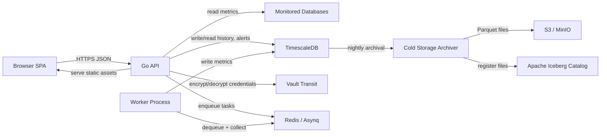

# SQL Optima

**The Open-Source SQL Tuning Assistant & Monitoring Platform for PostgreSQL and SQL Server.**

SQL Optima is a self-hosted, performance-focused monitoring platform built with **Go** and **Vanilla JavaScript**. Designed for DBAs, SREs, and consultants who need more than charts, it encodes expert database knowledge into automated diagnostics so you can not only *see* problems, but *fix* them.

---

## UI preview

Screenshots live in [`docs/screenshots/`](docs/screenshots/).


*SQL Server Intelligence Report — forecasting and risk scoring.*


*PostgreSQL EXPLAIN plan analyzer with optimization recommendations.*

---

## Table of contents

- [UI preview](#ui-preview)
- [Getting started](#getting-started)
- [Verify your installation](#verify-your-installation)
- [Documentation](#documentation)
- [Why SQL Optima?](#why-sql-optima)
- [Deployment options](#deployment-options)
- [Target database setup](#target-database-setup)
- [Build binaries](#build-binaries)
- [Architecture](#architecture-overview)
- [Repository layout](#repository-layout)
- [Feature highlights](#feature-highlights)

---

## Getting started

**Fastest path:** follow the **[5-Minute Quickstart Guide](docs/QUICKSTART.md)** — clone, `docker compose up`, open the UI, add a server, and (optionally) spin up local HA test databases.

### What you need

| Requirement | Notes |
|-------------|--------|
| [Docker Desktop](https://www.docker.com/products/docker-desktop/) or Docker Engine + Compose V2 | Recommended for first run |
| Git | To clone this repository |
| Monitored PostgreSQL and/or SQL Server | Your own instances, **or** the [local HA test cluster](docs/QUICKSTART.md#local-test-environment-ha-clusters-for-development) described in the quickstart |

### Run SQL Optima (Docker — recommended)

```bash
git clone https://github.com/rsharma155/sql_optima.git
cd sql_optima/docker
cp .env.example .env          # set JWT_SECRET and DB_PASSWORD before production use
docker compose up --build
```

Open **[http://localhost:8080](http://localhost:8080)** — the Global Estate Overview loads immediately. Compose defaults to **`AUTH_REQUIRED=1`**; create an admin user with `go run reset_password.go` in `backend/` (see [Quickstart](docs/QUICKSTART.md)).

**What starts automatically**

| Service | Purpose |
|---------|---------|
| **api** | Go backend + SPA on port **8080** |
| **timescaledb** | TimescaleDB (PostgreSQL 16) for metrics and registry |
| **vault** | HashiCorp Vault (dev mode) — Transit KMS for credential encryption |
| **vault-setup** | One-shot: enables Transit and creates the encryption key |
| **schema-setup** | One-shot: applies schema, rules, alerts, and seed data |

**Add monitored databases** from **Admin → Add New Server** in the UI (no `config.yaml` required). Credentials are encrypted with Vault Transit. See [docs/QUICKSTART.md § Add your first server](docs/QUICKSTART.md#4-add-your-first-monitored-server).

```bash
# Stop (data kept)
docker compose down

# Stop and remove volumes (destroys TimescaleDB + Vault data)
docker compose down -v
```

**Create or reset a local admin user** (when `AUTH_REQUIRED=1`):

```bash
cd backend
NEW_ADMIN_PASSWORD="Admin123!ChangeMe" go run reset_password.go
```

### Choose a deployment path

| Goal | Guide |
|------|--------|
| First-time install in ~5 minutes | **[docs/QUICKSTART.md](docs/QUICKSTART.md)** |
| No real DBs yet — local PG + SQL Server HA + load generator | **[QUICKSTART → Local test environment](docs/QUICKSTART.md#local-test-environment-ha-clusters-for-development)** |
| Develop the Go API locally, DB in Docker | [Option 2: Dev workflow](#option-2-timescaledb-via-docker--manual-go-server-dev-workflow) below |
| Bring your own TimescaleDB (no Docker for DB) | [Option 3: Dedicated TimescaleDB](#option-3-dedicated-postgresql--timescaledb-no-docker) below |
| Production-like stack (Redis worker, Prometheus, Grafana) | [Platform Compose](#platform-compose-production-profile) below |

### Video walkthrough?

There is **no official screencast** in this repo yet. The **[Quickstart](docs/QUICKSTART.md)** plus the **[Verify your installation](#verify-your-installation)** checklist below are enough to go from zero to a working dashboard. If you record a walkthrough for your team, link it in your fork’s README or open a PR to add `docs/WALKTHROUGH.md`.

---

## Verify your installation

Use this checklist after `docker compose up` (or any deployment option). It mirrors what a short demo video would cover.

| Step | Action | Expected result |
|------|--------|-----------------|
| 1 | Open `http://localhost:8080` | Global Estate Overview loads (may be empty) |
| 2 | **Admin → Add New Server** — register PostgreSQL or SQL Server | Server appears in the list; live metrics begin within one collector cycle |
| 3 | Open engine dashboard (PostgreSQL or SQL Server) | Live panels show current DMV/catalog data |
| 4 | Wait **~15 minutes** (default collector cadence) | Historical charts and Storage & Index Health begin filling |
| 5 | (Optional) Run target DB grants — see [Target database setup](#target-database-setup) | Permission check in Admin returns green / supplies grant scripts |
| 6 | (Optional) `curl -s http://localhost:8080/health` or check API logs | API healthy; no repeated connection errors to TimescaleDB |

**No data on historical dashboards?** Confirm the server is registered, collectors are running (API logs), and you have waited at least two collection intervals. After an API restart, allow [1–2 warm-up cycles](docs/operations.md#api-restarts-and-metric-deltas-p2-7) before trusting delta-based charts.

**Need demo databases?** Use the companion [sqlserver_postgres_ha_cluster](https://github.com/rsharma155/sqlserver_postgres_ha_cluster) project — full connection table in [docs/QUICKSTART.md](docs/QUICKSTART.md#local-test-environment-ha-clusters-for-development).

---

## Documentation

Docs are grouped by role. Start with **Quickstart**, then drill into operations and architecture as you deploy.

### New users and evaluators

| Document | Description |
|----------|-------------|
| **[docs/QUICKSTART.md](docs/QUICKSTART.md)** | Step-by-step install, first server, local HA test clusters, troubleshooting |
| **[ARCHITECTURE.md](ARCHITECTURE.md)** | Components, trust boundaries, live vs historical query paths |
| **[ROADMAP.md](ROADMAP.md)** | Shipped features and near-term plans |
| **[RELEASES.md](RELEASES.md)** | Release notes and upgrade context (current: **0.5.0**) |
| **[CHANGELOG.md](CHANGELOG.md)** | Version-by-version changes (Keep a Changelog) |

### Operators and production

| Document | Description |
|----------|-------------|
| **[docs/operations.md](docs/operations.md)** | Restarts, collector warm-up, retention, day-2 operations |
| **[docs/vault_production.md](docs/vault_production.md)** | Vault Transit in production (AppRole, backups, TLS) — not dev-mode root tokens |
| **[docs/os_collector.md](os_collector/README.md)** | PostgreSQL host agent (Linux shell) — RAM/CPU for Memory dashboard |
| **[os_collector/README.md](os_collector/README.md)** | Install agent on DB hosts; **download zip** from Admin or PG Memory/CPU UI |
| **[SECURITY.md](SECURITY.md)** | Disclosure policy and security expectations |
| **[docs/threat_model.md](docs/threat_model.md)** | Threats, mitigations, and trust assumptions |
| **[docker/.env.example](docker/.env.example)** | All environment variables with inline comments |

### Developers and integrators

| Document | Description |
|----------|-------------|
| **[CONTRIBUTING.md](CONTRIBUTING.md)** | Dev setup, tests, PR expectations |
| **[docs/API.md](docs/API.md)** | REST API reference |
| **[docs/api_errors.md](docs/api_errors.md)** | API error format and client-facing messages |
| **[docs/release_engineering.md](docs/release_engineering.md)** | Versioning, GHCR images, tagging releases |
| **[infrastructure/sql_scripts/README.md](infrastructure/sql_scripts/README.md)** | Schema scripts, migrations, collector SQL layout |

### Deep dives and internals

| Document | Description |
|----------|-------------|
| **[docs/duplicate_metrics_handler.md](docs/duplicate_metrics_handler.md)** | How collectors avoid duplicate TimescaleDB writes (delta tracking) |
| **[docs/sqlserver_workload_dashboard_review.md](docs/sqlserver_workload_dashboard_review.md)** | Workload Analytics design, APIs, and data policy |
| **[docs/rule_engine/missing_coverage_best_practices.md](docs/rule_engine/missing_coverage_best_practices.md)** | Best-practice rule coverage gaps |

---

## Why SQL Optima?

Most monitoring tools collect metrics and show dashboards. SQL Optima focuses on **optimization workflows**:

* **Actionable insights:** Identifies queries driving high CPU and supports EXPLAIN plan analysis (PostgreSQL).
* **Expert knowledge:** Built-in rules engine (15+ evaluators per engine) encodes DBA best practices.
* **Predictive analysis:** Rule-based health reports with statistical forecasting for storage and capacity.
* **Long-term retention:** Optional tiered archival to S3-compatible storage (Parquet, optional Iceberg catalog).
* **Privacy-first:** No telemetry. 100% self-hosted — data and credentials stay in your infrastructure.
* **Dual-engine support:** PostgreSQL and SQL Server from a single UI.

**Target audience:** DBAs and performance engineers, consultants, SREs/DevOps teams needing deduplicated alerting and dense metrics.

---

## Deployment options

### Option 1: Docker Compose (recommended)

Same as [Getting started](#getting-started). Full narrative: **[docs/QUICKSTART.md](docs/QUICKSTART.md)**.

**API example** — register a server without the UI:

```bash
curl -X POST http://localhost:8080/api/admin/servers \
  -H 'Content-Type: application/json' \
  -d '{"name":"PG-Prod","db_type":"postgres","host":"10.0.5.21","port":5432,"username":"monitor","password":"secret"}'
```

### Option 2: TimescaleDB via Docker + manual Go server (dev workflow)

Use when hacking on the Go backend locally.

**Phase 1 — TimescaleDB**

```bash
cd infrastructure/docker
cp ../../docker/.env.example .env
docker compose up -d
docker logs dbmonitor_timescaledb
```

**Phase 2 — API** ([Go 1.26+](https://go.dev/dl/))

```bash
cd backend
go mod tidy
go run cmd/server/main.go
```

Open **http://localhost:8080**. On first run, the **Setup Wizard** connects to TimescaleDB. Apply scripts in `infrastructure/sql_scripts/` before or via `schema-setup` in Docker.

**Phase 3 — stop**

```bash
cd infrastructure/docker && docker compose down
```

### Option 3: Dedicated PostgreSQL / TimescaleDB (no Docker)

Your server must have the [TimescaleDB extension](https://docs.timescale.com/install/latest/).

```bash
cd backend
go mod tidy
go run cmd/server/main.go
```

Follow the **Setup Wizard** at **http://localhost:8080** (connection test, schema check, admin user). Apply `infrastructure/sql_scripts/` on TimescaleDB first — see [infrastructure/sql_scripts/README.md](infrastructure/sql_scripts/README.md).

### Platform Compose (production profile)

Redis (Asynq worker), Prometheus, and Grafana:

```bash
export JWT_SECRET=$(openssl rand -base64 32)
docker compose -f docker-compose.platform.yml up -d
```

Auth defaults to on (`AUTH_REQUIRED=1`). See [docs/operations.md](docs/operations.md) and [docs/vault_production.md](docs/vault_production.md).

---

## Target database setup

Grant the monitoring role on **target** databases (not on TimescaleDB):

### SQL Server

```powershell
sqlcmd -S <server> -i infrastructure/sql_scripts/sqlserver_init.sql
```

### PostgreSQL

```bash
psql -U postgres -f infrastructure/sql_scripts/pgsql_init.sql
psql -U postgres -d <target_db> -c "SELECT grant_db_permissions();"
```

Use **Admin → Check permissions** to validate grants and download scripts. Details: [docs/QUICKSTART.md § Next steps](docs/QUICKSTART.md#5-next-steps).

---

## Build binaries

```bash
# API server
cd backend && go build -o ../dist/sql-optima ./cmd/server
./dist/sql-optima
```

### OS collector (optional — PostgreSQL Linux hosts)

Host RAM, swap, CPU, load, and PostgreSQL process RSS are **not** available through a normal PostgreSQL monitoring connection. A small **bash agent** on each **PostgreSQL Linux host** pushes metrics to SQL Optima (no Go install on the DB server).

**Recommended flow (from the UI):**

1. On the monitoring server, set `OS_METRICS_INGEST_ENABLED=1` and restart the API (see below).
2. In SQL Optima, **Download bundle (.zip)** — **Admin → Add server** (PostgreSQL) or **PostgreSQL → Memory / CPU** when host metrics are missing.
3. On the database host: unzip and run `./quick-install.sh` (prompts for admin JWT once; **creates a cron job** every 5 minutes).

The zip is **pre-filled** with instance name, **server ID**, **app URL**, and metrics endpoint (`bundled-config.env`). For ~30s sampling use `sudo ./sql-optima-os-collector.sh install --systemd` instead of cron.

| Guide | Contents |
|-------|----------|
| **[os_collector/README.md](os_collector/README.md)** | Quick install, cron vs systemd, troubleshooting |
| **[docs/os_collector.md](docs/os_collector.md)** | API ingest enablement and architecture |

On the monitoring server:

```bash
OS_METRICS_INGEST_ENABLED=1
AUTH_REQUIRED=1
```

---

## Architecture overview


```mermaid
flowchart LR
  Browser[Browser SPA] -->|HTTPS JSON| Api[Go API]
  Api -->|read metrics| TargetDBs[Monitored Databases]
  Api -->|write/read history, alerts| Timescale[TimescaleDB]
  Api -->|encrypt/decrypt credentials| Vault[Vault Transit]
  Api -->|serve static assets| Browser
  Api -->|enqueue tasks| Redis[Redis / Asynq]
  Worker[Worker Process] -->|dequeue + collect| Redis
  Worker -->|write metrics| Timescale
  Timescale -->|nightly archival| Archiver[Cold Storage Archiver]
  Archiver -->|Parquet files| S3[S3 / MinIO]
  Archiver -->|register files| Iceberg[Apache Iceberg Catalog]
```

See **[ARCHITECTURE.md](ARCHITECTURE.md)** for live vs historical paths, collectors, and security boundaries.

---

## Repository layout

| Path | Purpose |
|------|---------|
| `docker/docker-compose.yml` | Primary stack — API + TimescaleDB + Vault + schema bootstrap |
| `docker-compose.platform.yml` | Production profile — worker, Redis, Prometheus, Grafana |
| `infrastructure/sql_scripts/` | Schema, seeds, migrations, target DB setup — [README](infrastructure/sql_scripts/README.md) |
| `backend/` | Go API, collectors, services, repositories |
| `frontend/` | Static SPA served by the API |
| `os_collector/` | Linux bash host agent — UI zip download, `quick-install.sh`, cron or systemd |
| `VERSION` | Current release version (e.g. `0.5.0`) |
| `docs/` | Operator and developer documentation |

---

## Feature highlights

The sections below summarize major modules. For API paths and behavior, use **[docs/API.md](docs/API.md)**.

### PostgreSQL and SQL Server dashboards

- **PostgreSQL:** Control Center, sessions, locks, pg_stat_statements, EXPLAIN analyzer, storage, replication/HA, autovacuum, enterprise monitor, best practices (OS-aware when host metrics exist), CPU/memory (optional [**OS collector**](os_collector/README.md) bash agent on the DB host), waits, **Backup & DR** (policy + readiness), alerts.
- **SQL Server:** Instance dashboard, **Intelligence Report**, CPU/memory drilldowns, HA/AG, workload analytics, query analysis (statement fingerprint), locks & blocking, wait stats, plan analyzer, performance debt, **Backup & Recovery**, agent jobs, alerts, best practices.

### SQL Server Intelligence Report

Rule-based health analysis with linear-regression forecasting, hardware-aware thresholds, 0–100 risk scoring across six domains, and data-sufficiency guards (≥3h for rules, ≥24h for forecasting).

### OS collector (optional — PostgreSQL)

Push-based host telemetry from the database machine: RAM, swap, CPU, load, and summed `postgres` process RSS. Delivered as a **bash script** plus UI-generated zip ([`os_collector/`](os_collector/)) — no Go on the DB host (replaces the legacy Go agent in 0.5.0).

- Download bundle from the app (pre-filled **instance name**, **server ID**, **app URL**).
- **Enable ingest** from the UI (stored in `optima_platform_settings`) or set `OS_METRICS_INGEST_ENABLED=1` in `.env`.
- On the host: `./quick-install.sh` → installs **cron** (every 5 min); enter admin JWT once.
- Alternative: `install --systemd` for a ~30s daemon loop.

Powers the **OS Collector** badge on **PostgreSQL → Memory** and **CPU**. Details: [os_collector/README.md](os_collector/README.md), [docs/os_collector.md](docs/os_collector.md).

### Backup & DR (PostgreSQL and SQL Server)

- **PostgreSQL:** Backup runs, WAL/archive posture, DR policy API (`/api/postgres/dr-policy`), readiness chips — **PostgreSQL → Backups**.
- **SQL Server:** `msdb` posture and history collectors, RPO policy, readiness summary — **SQL Server → Backup & Recovery**.

### Admin diagnostics (SQL Server)

When historical charts are empty, admins can call `GET /api/admin/diagnostics/sqlserver/{instance}` for Timescale row counts and collector hints (no credentials returned). See [docs/operations.md](docs/operations.md).

### Cold storage (optional)

Nightly archival of aged TimescaleDB rows to S3-compatible storage as **Parquet**, with optional **Iceberg** catalog registration. Configure via `COLD_STORAGE_*` in `docker/.env.example`.

### Alert engine

Fingerprint-based deduplication (`SHA-256` per rule+instance), advisory-lock singleton evaluation, maintenance windows, and append-only `optima_alert_history`. Built-in evaluators cover blocking, jobs, disk, replication lag, and backup freshness. Mutations use JWT-derived actors only.

### Storage & Index Health

Cross-engine historical views (index usage deltas, scan hotspots, growth trends, duplicate index candidates). Timescale-backed; allow ~15 minutes after first deploy for data. Endpoints under `/api/timescale/storage-index-health/*`.

### Security checklist (production)

1. Set a strong **`JWT_SECRET`** (never use the dev default in shared environments).
2. Set **`AUTH_REQUIRED=1`**.
3. Register targets via **Admin** — credentials encrypted at rest (Vault Transit or local KMS fallback for dev only).
4. Use **[docs/vault_production.md](docs/vault_production.md)** — external Vault with AppRole; avoid dev root tokens.
5. See **[SECURITY.md](SECURITY.md)** for reporting vulnerabilities.

---

## Contributing

We welcome issues and pull requests. Read **[CONTRIBUTING.md](CONTRIBUTING.md)** for tests, schema changes, and PR guidelines.

**License:** See repository license file. **Security issues:** **[SECURITY.md](SECURITY.md)** — please do not open public issues for vulnerabilities.
