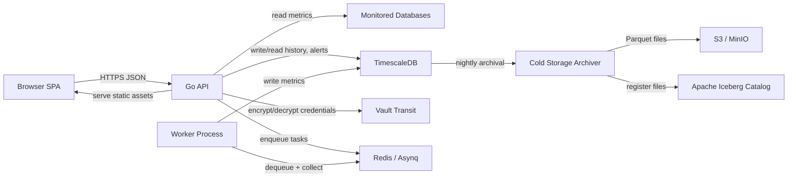

# SQL Optima

**The Open-Source SQL Tuning Assistant & Monitoring Platform for PostgreSQL and SQL Server.**

SQL Optima is a self-hosted, performance-focused monitoring platform built with **Go** and **Vanilla JavaScript**. Designed for DBAs, SREs, and consultants who need more than just charts, it encodes expert database knowledge into automated diagnostics, helping you not just *see* problems, but *fix* them.

---

## Why SQL Optima?

Most monitoring tools collect metrics and show dashboards. SQL Optima goes further by focusing on **optimization workflows**:

*   **Actionable Insights:** Instead of just showing high CPU, it identifies the specific queries causing it and provides EXPLAIN plan analysis.
*   **Expert Knowledge:** Built-in rules engine (15+ evaluators per engine) encodes years of DBA best practices.
*   **Predictive Analysis:** Autonomous health reports forecast storage and capacity issues before they happen.
*   **Long-Term Retention:** Tiered storage automatically archives historical metrics to S3-compatible object storage (MinIO, AWS S3) in Parquet format with optional Apache Iceberg catalog registration.
*   **Privacy-First:** **No Telemetry.** 100% self-hosted. Your data and credentials never leave your infrastructure.
*   **Dual-Engine Support:** Deep, vendor-aware support for both PostgreSQL and SQL Server from a single UI.

---

## UI Preview


*SQL Server Intelligence Report showing predictive forecasting and risk scoring.*


*PostgreSQL EXPLAIN plan analyzer with optimization recommendations.*

---

## Target Audience

*   **DBAs & Performance Engineers:** Automated playbooks for troubleshooting and tuning.
*   **Consultants:** A portable toolkit to quickly analyze client environments.
*   **SREs & DevOps:** High-density metrics with fingerprint-based deduplicated alerting.

---

## Quick Start — Docker Compose (Recommended)

> **New to SQL Optima?** Check out the [**5-Minute Quickstart Guide**](docs/QUICKSTART.md) for a step-by-step walkthrough.

This brings up **TimescaleDB + Vault (Transit KMS) + Go API + static UI** with automatic schema bootstrap. You can then add monitored SQL Server / PostgreSQL targets from the web UI — no `config.yaml` editing required.

### Prerequisites
- [Docker Desktop](https://www.docker.com/products/docker-desktop/) or Docker Engine with Compose V2.

### Steps

```bash
cd docker
cp .env.example .env          # optional — edit to change ports, passwords, or enable auth
docker compose up --build
```

Open **http://localhost:8080** — the Global Estate Overview loads immediately.

### What starts automatically

| Service | Purpose |
|---------|---------|
| **api** | Go backend serving the API + SPA UI on port 8080 |
| **timescaledb** | TimescaleDB (pg16) for metric / time-series storage |
| **vault** | HashiCorp Vault dev-mode (Transit KMS for credential encryption) |
| **vault-setup** | One-shot: enables Transit engine and creates the encryption key |
| **schema-setup** | One-shot: applies schema, rule engine, alert engine, seed data to TimescaleDB |

### Adding monitored servers

After the stack is running, add targets from the **Admin** panel in the UI or via the API:

```bash
# API example
curl -X POST http://localhost:8080/api/admin/servers \
  -H 'Content-Type: application/json' \
  -d '{"name":"PG-Prod","db_type":"postgres","host":"10.0.5.21","port":5432,"username":"monitor","password":"secret"}'
```

Credentials are encrypted at rest using Vault Transit.

### Stopping

```bash
docker compose down            # data persists in the timescaledb_data volume
docker compose down -v         # also removes stored data
```

### Create / reset admin user (local auth)

```bash
cd backend
NEW_ADMIN_PASSWORD="Admin123!ChangeMe" go run reset_password.go
```

---

## Option 2: TimescaleDB via Docker + Manual Go Server (dev workflow)

Use this when you want to develop the Go backend locally but still need TimescaleDB.

### Phase 1 — Start TimescaleDB

```bash
cd infrastructure/docker
cp ../../docker/.env.example .env    # adjust DB_PASSWORD
docker compose up -d
docker logs dbmonitor_timescaledb    # verify healthy
```

### Phase 2 — Run the Go backend

Requires [Go 1.26+](https://go.dev/dl/).

```bash
cd backend
go mod tidy
go run cmd/server/main.go
```

Open **http://localhost:8080** — If this is the first run, the **Setup Wizard** will appear to help you connect to the TimescaleDB instance. Ensure you have run the schema initialization scripts (from `infrastructure/sql_scripts/`) against TimescaleDB prior to this.

### Phase 3 — Stop TimescaleDB

```bash
cd infrastructure/docker
docker compose down
```

---

## Option 3: Dedicated PostgreSQL / TimescaleDB (no Docker)

> Your PostgreSQL server **must** have the [TimescaleDB extension](https://docs.timescale.com/install/latest/) installed.

### Run the backend

```bash
cd backend
go mod tidy
go run cmd/server/main.go
```

Open **http://localhost:8080** and follow the **Setup Wizard**. The UI will:
1. Test your connection to the dedicated TimescaleDB.
2. Allow you to verify that the **schema is initialized** (Ensure you have applied the scripts in `infrastructure/sql_scripts/` beforehand).
3. Create your initial admin user.

---

## SQL Server Intelligence Report (Autonomous Analysis)

The **Intelligence Report** is a dedicated module that performs deep-dive health analysis of SQL Server instances using an expert rule engine and time-series forecasting.

### Key Capabilities
- **Predictive Forecasting**: Uses linear regression to estimate "Days to Failure" for storage, memory, and CPU.
- **Dynamic Thresholding**: Computes thresholds based on actual server hardware (cores, RAM) and historical P95 baselines.
- **Risk Scoring**: Generates a 0-100 score across 6 domains (Performance, Capacity, Availability, Replication, Maintenance, Query).
- **Data Sufficiency Guard**: Smart logic that requires at least 3 hours of data for rules and 24 hours for forecasting to ensure accuracy.

---

## Cold Storage — Tiered Metric Archival

SQL Optima includes an optional **cold storage pipeline** that automatically offloads historical TimescaleDB metrics to S3-compatible object storage in **Apache Parquet** format. This enables long-term retention beyond TimescaleDB's hot-tier window, and makes historical data queryable by tools like DuckDB, Apache Spark, or Trino.

### How it works

1. A nightly archiver job reads aged-out rows from TimescaleDB (controlled by `COLD_STORAGE_LAG_DAYS`).
2. Rows are serialised to Parquet files in a local staging directory, then uploaded to the configured S3 bucket.
3. Optionally, each file is registered with an **Apache Iceberg REST catalog** (e.g. Project Nessie) so the full dataset remains queryable as a single logical table.
4. Source rows older than `COLD_STORAGE_PURGE_RETENTION_DAYS` are purged from TimescaleDB after a successful upload, keeping the hot tier lean.

### Enabling cold storage

Set the following environment variables (see `docker/.env.example` for all defaults):

| Variable | Description | Default |
|----------|-------------|---------|
| `COLD_STORAGE_ENABLED` | Enable the archival pipeline | `false` |
| `COLD_STORAGE_ENDPOINT` | S3-compatible endpoint URL | `http://minio:9000` |
| `COLD_STORAGE_BUCKET` | Target bucket name | `sql-optima-cold` |
| `COLD_STORAGE_REGION` | AWS region (or `us-east-1` for MinIO) | `us-east-1` |
| `COLD_STORAGE_ACCESS_KEY_ID` | S3 access key | _(empty)_ |
| `COLD_STORAGE_SECRET_ACCESS_KEY` | S3 secret key | _(empty)_ |
| `COLD_STORAGE_PREFIX` | Key prefix inside the bucket | `metrics/` |
| `COLD_STORAGE_BATCH_SIZE` | Rows per Parquet file | `50000` |
| `COLD_STORAGE_LAG_DAYS` | Minimum age (days) of rows to export | `2` |
| `COLD_STORAGE_PURGE_RETENTION_DAYS` | Delete hot-tier rows older than N days after export | `30` |
| `COLD_STORAGE_STAGING_DIR` | Local staging directory for Parquet files | `/tmp/sql-optima-cold-staging` |
| `COLD_STORAGE_CATALOG_URL` | Iceberg REST catalog URL (optional) | _(empty)_ |

### Local MinIO quickstart

```bash
# Start MinIO alongside the rest of the stack
docker compose -f docker-compose.platform.yml up -d minio

# Or run MinIO standalone
docker run -p 9000:9000 -p 9001:9001 \
  -e MINIO_ROOT_USER=sqloptima \
  -e MINIO_ROOT_PASSWORD=change_me_in_production \
  minio/minio server /data --console-address ":9001"
```

Then set `COLD_STORAGE_ENABLED=true` and configure the `COLD_STORAGE_ACCESS_KEY_ID` / `COLD_STORAGE_SECRET_ACCESS_KEY` in your `.env`.

---

## Build standalone binaries

```bash
# Build API server
cd backend
go build -o ../dist/sql-optima ./cmd/server

# Build OS collector (optional, for remote hosts)
cd ../os_collector
go build -o ../dist/os-collector .
```

Run the API from anywhere:

```bash
./dist/sql-optima
```

---

## Configuration

### Adding monitored targets

**Recommended:** Use the **Admin** panel in the web UI. Credentials are encrypted with Vault Transit (or a local KMS) and stored in the TimescaleDB server registry. This is the primary way to manage monitoring targets.

> Targets added via the UI are persisted in the metrics database and automatically reloaded when the server restarts.

---

## Platform Compose (production profile)

For production-like deployments with Redis (Asynq worker queue), Prometheus, and Grafana:

```bash
# Requires JWT_SECRET to be set
export JWT_SECRET=$(openssl rand -base64 32)
docker compose -f docker-compose.platform.yml up -d
```

This starts: API, worker, TimescaleDB, Redis, Prometheus, and Grafana. Auth is enabled by default (`AUTH_REQUIRED=1`).

---

## Target database setup scripts

Provision monitoring roles on your target databases so SQL Optima can collect telemetry.

### SQL Server

```powershell
sqlcmd -S <server> -i infrastructure/sql_scripts/sqlserver_init.sql
```

### PostgreSQL

```bash
psql -U postgres -f infrastructure/sql_scripts/pgsql_init.sql
psql -U postgres -d <target_db> -c "SELECT grant_db_permissions();"
```

---

## Architecture Overview

SQL Optima is built for scale and security. It uses a Go-based backend for high-performance collection and a TimescaleDB core for efficient time-series storage.


```mermaid
flowchart LR
  Browser[Browser SPA] -->|HTTPS JSON| Api[Go API]
  Api -->|read metrics| TargetDBs[Monitored Databases]
  Api -->|write/read history, alerts| Timescale[TimescaleDB]
  Api -->|encrypt/decrypt credentials| Vault[Vault Transit]
  Api -->|serve static assets| Browser
  Api -->|enqueue tasks| Redis[Redis / Asynq]
  Worker[Worker Process] -->|dequeue + collect| Redis
  Worker -->|write metrics| Timescale
  Timescale -->|nightly archival| Archiver[Cold Storage Archiver]
  Archiver -->|Parquet files| S3[S3 / MinIO]
  Archiver -->|register files| Iceberg[Apache Iceberg Catalog]
```

*For more details, see [ARCHITECTURE.md](ARCHITECTURE.md).*

---

## Repository layout

| Path | Purpose |
|------|---------|
| `docker/docker-compose.yml` | **Primary** compose — API + TimescaleDB + Vault + schema bootstrap |
| `docker-compose.platform.yml` | Production profile — adds worker, Redis, Prometheus, Grafana |
| `Dockerfile` | Multi-stage build for the API server (distroless non-root image) |
| `Dockerfile.worker` | Multi-stage build for the background worker |
| `infrastructure/docker/` | Standalone TimescaleDB compose for local dev (Option 2) |
| `infrastructure/sql_scripts/` | Schema, seed data, rule engine, alert engine, and target DB setup scripts |
| `backend/` | Go API, collector, service layer, repository, middleware |
| `backend/internal/storage/hot/` | In-process hot storage layer (TimescaleDB write path) |
| `backend/internal/storage/cold/` | Cold storage pipeline — Parquet export, S3 upload, Iceberg catalog registration |
| `backend/internal/storage/archiver/` | Nightly archiver that moves aged-out metrics from hot → cold tier |
| `backend/internal/intel/` | Autonomous intelligence engine — forecasting, risk scoring, anomaly detection, recommendations |
| `os_collector/` | Lightweight agent for push-based host telemetry |
| `frontend/` | Static SPA (HTML/CSS/JS) served by the Go backend |
| `docs/` | API reference, threat model, architecture docs |
| `config.yaml` | (Optional) Legacy instance definitions (not needed when using server registry) |

---

## Alert Engine

The built-in alert engine continuously evaluates rules against every monitored instance and creates deduplicated, auditable alerts.

### Key design

- **Fingerprint-based dedup** — each rule+instance combination produces a stable SHA-256 fingerprint. A partial unique index (`fingerprint WHERE status IN ('open', 'acknowledged')`) ensures only one active alert per fingerprint; subsequent evaluations bump `hit_count` and `last_seen_at` instead of creating duplicates.
- **Singleton evaluation** — the background loop uses `pg_try_advisory_xact_lock` so that in multi-replica deployments only one process evaluates per tick.
- **Maintenance windows** — suppress alert creation for a given instance + engine during scheduled maintenance.
- **Audit trail** — every status transition (open → acknowledged → resolved) is recorded in `optima_alert_history` with actor, reason, and timestamp.
- **Auth-derived actor** — mutation endpoints (`acknowledge`, `resolve`, `create maintenance window`) extract the actor identity from JWT claims; no client-supplied `actor` field is trusted.

### Built-in evaluators

| Evaluator | Engine | Category |
|-----------|--------|----------|
| Blocking sessions | SQL Server | blocking |
| Failed agent jobs | SQL Server | jobs |
| Disk space | SQL Server | storage |
| Replication lag | PostgreSQL | replication |
| Blocking queries | PostgreSQL | blocking |
| Backup freshness | PostgreSQL | backup |
| Disk space | PostgreSQL | storage |

### API endpoints

| Endpoint | Method | Description |
|----------|--------|-------------|
| `/api/alerts` | GET | List alerts (filter by status, instance, severity, engine) |
| `/api/alerts/{id}` | GET | Get alert detail |
| `/api/alerts/{id}/acknowledge` | POST | Acknowledge — body `{"reason": "..."}` is optional |
| `/api/alerts/{id}/resolve` | POST | Resolve — body `{"reason": "..."}` is optional |
| `/api/alerts/count` | GET | Count open alerts for an instance |
| `/api/alerts/maintenance` | POST | Create maintenance window |
| `/api/alerts/maintenance` | GET | List active maintenance windows |
| `/api/alerts/maintenance/{id}` | DELETE | Delete maintenance window |

### Admin — Permission check

Probe whether the monitoring role has the required grants and generate ready-to-run SQL scripts:

| Endpoint | Method | Description |
|----------|--------|-------------|
| `/api/admin/servers/check-permissions-draft` | POST | Check permissions for a server definition not yet saved; returns `grant_script` and `create_user_script` |
| `/api/admin/servers/{id}/check-permissions` | POST | Check permissions for a registered server by ID |

---

## Storage & Index Health (Timescale-backed)

The **Storage & Index Health** dashboard is a cross-engine page (`storage-index-health`) that reads historical snapshots from TimescaleDB and surfaces:

- **Index usage deltas** (seeks/scans/lookups/updates) and "unused index" candidates with index definition detail
- **High-scan tables** (scan-to-seek ratios) and scan hotspots
- **Largest tables / indexes** by size
- **Growth trends** (table + index) with simple projections
- **Duplicate index candidates** (requires index-definition snapshots)

### Backend endpoints

All endpoints are **Timescale reads** and require `engine` and `instance` query parameters.

| Endpoint | Description |
|----------|-------------|
| `GET /api/timescale/storage-index-health/filters` | Distinct db/schema/table options |
| `GET /api/timescale/storage-index-health/dashboard` | Pre-aggregated KPIs, hotspots, candidates |
| `GET /api/timescale/storage-index-health/index-usage` | Index usage point series |
| `GET /api/timescale/storage-index-health/table-usage` | Table usage point series |
| `GET /api/timescale/storage-index-health/growth` | Table/index growth trends |
| `GET /api/timescale/storage-index-health/index-definition` | Index CREATE statement details |

> After first deploy, dashboards will be empty until the historical collector has run a few ticks (~15 min cadence for index/table usage; growth snapshots are coarser).

---

## Security operations checklist

1. **JWT**: Set `JWT_SECRET` to a long random value in any shared or production environment. The server logs a warning if it falls back to the development default.
2. **API exposure**: All monitoring API endpoints now strictly enforce JWT authentication. The API is no longer public. Ensure `AUTH_REQUIRED=1` is set in your environment variables.
3. **Secrets**: Use the Admin UI to register monitored servers. Credentials added via the UI are encrypted at rest (using Vault Transit or a local KMS) and never stored in plain text.
4. **Auth**: Set `AUTH_REQUIRED=1` in production.
5. **Vault**: For production, use external Vault with AppRole/policies — do not use dev-mode root tokens.

---

## Documentation

| Document | Description |
|----------|-------------|
| [project_details.md](./project_details.md) | Application flow, SPA route map, sidebar behavior |
| [docs/API.md](./docs/API.md) | API endpoint reference |
| [docs/threat_model.md](./docs/threat_model.md) | Security threat model and mitigations |
| [ARCHITECTURE.md](./ARCHITECTURE.md) | System architecture and trust boundaries |
| [CONTRIBUTING.md](./CONTRIBUTING.md) | Contribution guidelines |
| [SECURITY.md](./SECURITY.md) | Security disclosure policy |

---

## PostgreSQL and SQL Server dashboards

- **PostgreSQL**: Control Center, sessions, locks, queries (pg_stat_statements), EXPLAIN analyzer, storage, replication/HA, autovacuum & bloat risk, enterprise monitor, best-practices, CPU/memory, wait stats, backup/DR overview, security posture, incident feed, connection utilization, alerts.
- **SQL Server**: Instance dashboard (real-time triage view with time-range selection), **Intelligence Report (Autonomous Analysis)**, CPU/memory drilldowns, live diagnostics, HA/AG, workload analytics, query analysis, enterprise metrics, performance debt, agent jobs (with auto-refresh), **Locks & Blocking Dashboard**, wait stats V2, watched query analyzer, plan analyzer, real-time delta metrics for queries, alerts, best practices; drilldowns for CPU, queries, bottlenecks, growth, indexes, locks, deadlocks.
