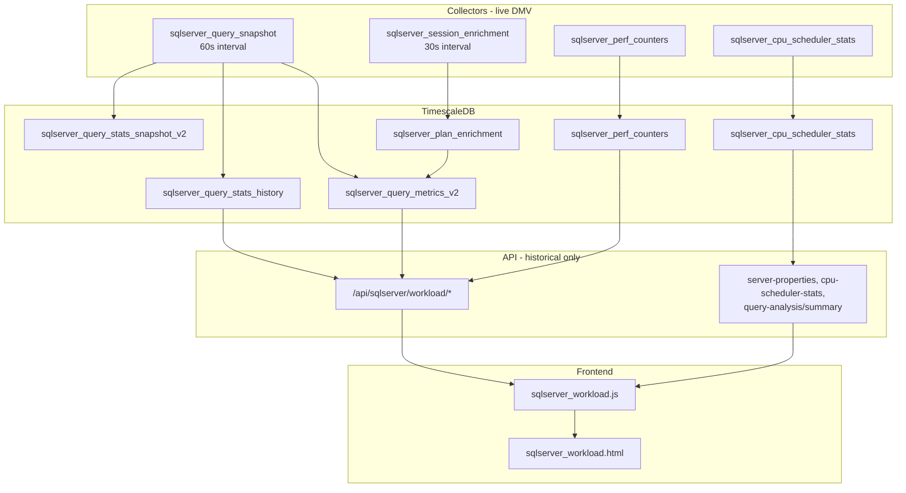

# SQL Server Workload Dashboard — Review & Findings

**Review date:** 2026-05-24  
**Scope:** Workload Analytics UI (`sqlserver-workload` route), API layer, DMV collectors, TimescaleDB read path  
**Audience:** DBAs, platform engineers, product owners  

---

## 1. Executive summary

The **Workload Analytics** dashboard (`SQL Server → Workload Analytics`) answers: *who and what consumed CPU and I/O over a selected time range?* It combines instance hardware, SQLOS scheduler pressure, DMV-based query deltas, and two Query Store KPIs on a single page.

**Strengths**

- Clear visual hierarchy: KPI strips → trend charts → tabbed workspace (Top Queries, CPU History, App/User Analysis).
- Solid historical pipeline: `sys.dm_exec_query_stats` snapshots → delta computation → Timescale hypertables → REST APIs.
- Top-queries panel applies extensive noise filtering (monitoring tools, system SQL patterns, Agent, SSMS).
- Chart lifecycle on this page destroys existing Chart.js instances before re-render (better than some other dashboards).

**Data access policy (enforced May 2026)**

- **Collectors** query live DMVs on a schedule and **insert into TimescaleDB**.
- **Dashboard APIs** for this page read **only TimescaleDB**; every `/api/sqlserver/workload/*` response sets `X-Data-Source: timescale`.
- **No live workload snapshot API** (WL-16 declined) — “right now” views must use the latest collector buckets in the selected time range.

**Remaining limitations (DBA-facing)**

1. **Freshness** — ~60s query snapshot + ~30s session enrichment lag.
2. **Perf-counter fallback** — When history is empty, trend charts may use `sqlserver_perf_counters` (still TimescaleDB, different semantics).
3. **Attribution** — Login/app from `plan_handle` enrichment; some rows stay `unknown`.

**Verdict:** Suitable for **historical workload triage** when collectors are healthy. Progress tracker items WL-01–WL-15 are implemented; see [Section 9](#9-progress-tracker).

---

## 2. How data flows



### Collector jobs

| Job | Interval | Source DMVs | Writes to |
|-----|----------|-------------|-----------|
| `sqlserver_query_snapshot` | 60s | `sys.dm_exec_query_stats`, `dm_exec_sql_text`, `dm_exec_plan_attributes` | Staging → deltas → `sqlserver_query_stats_history`, `sqlserver_query_metrics_v2`, snapshot state |
| `sqlserver_session_enrichment` | 30s | `sys.dm_exec_requests`, `sys.dm_exec_sessions` | `sqlserver_plan_enrichment` |
| `sqlserver_perf_counters` | (collector config) | Instance perf counters | `sqlserver_perf_counters` (trend fallback) |
| `sqlserver_cpu_scheduler_stats` | (collector config) | `dm_os_schedulers`, `dm_os_sys_info`, etc. | `sqlserver_cpu_scheduler_stats` (CPU History tab) |

Always on via Query V2 orchestrator at API startup. See Admin → Collector Control for job descriptions.

### Frontend entry points

| File | Role |
|------|------|
| `frontend/js/components/router.js` | Route `sqlserver-workload` → `SqlServerWorkloadDashboardView` |
| `frontend/js/pages/sqlserver_WorkloadDashboard.js` | View adapter; loads HTML via `ViewLoader` |
| `frontend/js/modules/sqlserver_workload.js` | All data fetch, chart render, table bind |
| `frontend/pages/sqlserver_workload.html` | Layout, KPIs, charts, tabs |

---

## 3. API reference

All workload routes: `GET`, query params `instance` (or `server_id`), `from`, `to` (ISO timestamps). Registered in `backend/internal/api/monitoring_routes.go`.

| Endpoint | Handler | Response key | Notes |
|----------|---------|--------------|-------|
| `/api/sqlserver/workload/summary` | `GetSummary` | Flat object | KPI aggregates |
| `/api/sqlserver/workload/trends` | `GetTrends` | `trends[]` | Falls back to perf counters if history empty |
| `/api/sqlserver/workload/top-queries` | `GetTopOffenders` | `top_offenders[]` | **Limit hardcoded to 20**; ignores `?limit=` |
| `/api/sqlserver/workload/app-load` | `GetAppLoadTimeline` | `app_load[]` | |
| `/api/sqlserver/workload/login-load` | `GetLoginLoadTimeline` | `login_load[]` | |
| `/api/sqlserver/workload/top-apps` | `GetTopApps` | `top_apps[]` | `?limit=` supported (default 10) |
| `/api/sqlserver/workload/top-logins` | `GetTopLogins` | `top_logins[]` | `?limit=` supported (default 10) |

**Related endpoints used by the same page (not under `/workload/`):**

| Endpoint | Purpose on page |
|----------|-----------------|
| `/api/sqlserver/server-properties` | Cores, RAM |
| `/api/sqlserver/cpu-scheduler-stats?limit=50` | Scheduler KPIs, CPU History chart/table |
| `/api/sqlserver/query-analysis/summary?exclude_system=true&database=all` | Top 10 CPU%, regressions (Query Store pipeline) |

### Response shapes (summary)

**`GET /workload/summary`**

```json
{
  "total_cpu_ms": 0,
  "total_executions": 0,
  "total_logical_reads": 0,
  "total_rows": 0,
  "max_memory_grant_kb": 0,
  "avg_cpu_per_exec": 0,
  "avg_reads_per_exec": 0
}
```

*`total_rows` and averages are computed server-side but not displayed in the UI.*

**`GET /workload/trends`**

```json
{
  "trends": [{
    "timestamp": "...",
    "cpu_ms": 0,
    "executions": 0,
    "logical_reads": 0,
    "rows_processed": 0,
    "max_grant_kb": 0,
    "max_dop": 0,
    "worst_query_ms": 0,
    "avg_cpu_ms": 0,
    "avg_rows": 0
  }]
}
```

*`worst_query_ms`, `max_dop`, `avg_cpu_ms`, `rows_processed` are not charted (dead JS references `wlEfficiencyChart`, `wlPressureChart` with no canvas).*

**`GET /workload/top-queries`**

```json
{
  "top_offenders": [{
    "query_hash": "0x...",
    "query_text": "...",
    "database_name": "...",
    "login_name": "...",
    "program_name": "...",
    "total_cpu_ms": 0,
    "total_executions": 0,
    "total_reads": 0,
    "total_rows": 0,
    "avg_cpu_ms": 0,
    "last_seen": "..."
  }]
}
```

---

## 4. Query reference appendix

### 4.1 Ingest — query snapshot (SQL Server)

**File:** `backend/internal/collectors/infrastructure/sqlserver/sqlserver_query_snapshot.go`

```sql
/* SQL_OPTIMA */
SELECT TOP 500
  COALESCE(pa.dbid, st.dbid) AS db_id,
  DB_NAME(...) AS database_name,
  qs.execution_count,
  qs.last_execution_time,  -- UTC-adjusted
  qs.total_worker_time/1000 AS total_cpu_ms,
  qs.total_elapsed_time/1000 AS total_elapsed_ms,
  qs.total_logical_reads, qs.total_logical_writes,
  qs.total_physical_reads, qs.total_rows, qs.total_grant_kb,
  qs.max_worker_time/1000, qs.max_logical_reads, qs.max_dop,
  qs.max_grant_kb, qs.max_rows,
  statement_text, st.text AS query_text_raw,
  qs.query_plan_hash, qs.query_hash, qs.plan_handle
FROM sys.dm_exec_query_stats qs WITH (NOLOCK)
CROSS APPLY sys.dm_exec_sql_text(qs.sql_handle) st
OUTER APPLY (dbid from sys.dm_exec_plan_attributes) pa
WHERE ISNULL(pa.dbid, st.dbid) > 4
  AND qs.statement_sql_handle IS NOT NULL
  AND qs.last_execution_time >= @last_watermark
ORDER BY qs.total_worker_time DESC;
```

**DBA notes**

- `TOP 500` ordered by **lifetime** `total_worker_time`, not period delta — hot plans outside the top 500 by cumulative CPU can be missed after watermark advance.
- Watermark filter on `last_execution_time` — plans not executed since last poll are skipped.
- `NOLOCK` on DMV — acceptable for monitoring; possible inconsistent reads.
- Restart detection via `sys.dm_os_sys_info.sqlserver_start_time` resets snapshot state.

### 4.2 Ingest — session enrichment (SQL Server)

**File:** `backend/internal/collectors/infrastructure/sqlserver/sqlserver_session_enrichment.go`

```sql
SELECT r.plan_handle, s.login_name, s.program_name,
       DB_NAME(r.database_id),
       CASE ... END AS is_user_workload
FROM sys.dm_exec_requests r
JOIN sys.dm_exec_sessions s ON r.session_id = s.session_id
WHERE r.plan_handle IS NOT NULL;
```

**DBA notes:** Only **currently executing** requests contribute login/app to `sqlserver_plan_enrichment`. Short queries may never be attributed.

### 4.3 Write path — metrics merge (TimescaleDB)

**File:** `backend/internal/collectors/infrastructure/timescaledb/sqlserver_writer.go`

Deltas from snapshot comparison → `sqlserver_query_stats_history`. Enriched rows:

```sql
INSERT INTO sqlserver_query_metrics_v2 (..., total_elapsed_ms, total_physical_reads, ...)
SELECT ..., d.cpu_delta_ms, 0,  -- total_elapsed_ms forced to 0
       d.reads_delta, 0,         -- total_physical_reads forced to 0
       ...
FROM deltas d
LEFT JOIN sqlserver_plan_enrichment e ON ...
```

Elapsed time is collected at snapshot time but **not stored** in metrics v2.

### 4.4 Read path — dashboard aggregations (TimescaleDB)

**File:** `backend/internal/storage/hot/sqlserver_ts_logger_workload.go`

| Method | Core SQL pattern |
|--------|------------------|
| `GetSqlServerWorkloadSummary` | `SUM(cpu_delta_ms, exec_delta, reads_delta, rows_delta)`, `MAX(period_max_grant_kb)` on `sqlserver_query_stats_history` |
| `GetSqlServerWorkloadTrends` | `time_bucket('1m'/'5m'/'15m', capture_timestamp)` + sums on history |
| `GetSqlServerWorkloadTrendsFromPerfCounters` | `Batch Requests/sec`, `Page Reads/sec` from `sqlserver_perf_counters` when history empty |
| `GetSqlServerWorkloadTopOffenders` | `GROUP BY query_hash` on `sqlserver_query_metrics_v2` + 15+ noise filters |
| App/login timeline & top-N | `GROUP BY` `application_name` / `login_name` on metrics v2, `is_user_workload = 1` only |

**Unused schema asset:** `sqlserver_query_stats_enriched` view (joins history + `sqlserver_query_identity_dim` + classification) is defined in `01_timescale_schema.sql` but **not used** by Go workload reads.

---

## 5. UI mapping (what the user sees)

### Row 1 — KPI strips

| Label | Element ID | Data source |
|-------|------------|-------------|
| Cores | `wl-prop-cpu` | `server-properties.cpu_count` |
| RAM GB | `wl-prop-mem` | `server-properties.physical_memory_gb` |
| CPU Sec | `wl-kpi-cpu` | `workload/summary.total_cpu_ms / 1000` |
| Throughput | `wl-kpi-execs` | `summary.total_executions` |
| IO Volume | `wl-kpi-reads` | `summary.total_logical_reads` |
| Active (workers) | `wl-sched-workers` | Latest `cpu-scheduler-stats` |
| Queue | `wl-sched-queue` | `total_work_queue_count` |
| Peak Grant | `wl-kpi-mem` | `summary.max_memory_grant_kb` |
| Top 10 CPU% | `kpi-cpu-share` | **Query Store** `query-analysis/summary` |
| Regressions | `kpi-regressions` | **Query Store** `query-analysis/summary` |

**Dead bindings (JS sets, HTML missing):** `wl-prop-sockets`, `wl-prop-ht`, `wl-prop-numa`, `wl-sched-runnable`, `wl-sched-mem`, `wl-sched-warnings`.

### Row 2 — Trend charts

| Chart title | Canvas | API field | Unit reality |
|-------------|--------|-----------|--------------|
| CPU Load Trend (sec) | `wlCpuTrendChart` | `cpu_ms / 1000` | Sum of CPU deltas per bucket ✓ |
| Executions per Sec | `wlExecTrendChart` | `executions` | **Misleading** — sum of exec deltas per bucket, not /sec |
| Logical Reads Rate | `wlReadTrendChart` | `logical_reads` | **Misleading** — sum of read deltas per bucket, not rate |

### Row 3 — Tabs

| Tab | Content | APIs |
|-----|---------|------|
| Top Queries | 8-column table, 20 rows | `top-queries` |
| CPU History | Scheduler line chart + 20-row table | `cpu-scheduler-stats` |
| App Analysis | Timeline + bar + share table | `app-load`, `top-apps` |
| User Analysis | Timeline + bar + share table | `login-load`, `top-logins` |

**Refresh behavior:** All APIs called on every `refreshAll()` (~30s interval via `collectorConfig.getInterval("SQL Server Query Analysis", 30000)`). No tab-lazy loading.

---

## 6. Findings by severity

### Critical (P0)

| ID | Finding | Impact |
|----|---------|--------|
| F-C1 | App/login timeline uses `r.bucket` as object key but looks up `l.toISOString()` | Line charts can show all zeros despite API data |
| F-C2 | No `destroy()` on route leave; `setInterval` continues after navigation | Background API calls, memory leak, Chart.js errors on re-entry |

### High (P1)

| ID | Finding | Impact |
|----|---------|--------|
| F-H1 | Chart titles “per Sec” / “Rate” vs delta sums | DBAs misread trends; wrong capacity decisions |
| F-H2 | `total_elapsed_ms` and physical reads written as 0 in metrics_v2 | No duration/latency or physical I/O story on dashboard |
| F-H3 | App/login aggregations lack top-queries noise filters | Monitoring/system SQL inflates app/user charts |
| F-H4 | Sortable Top Queries headers with no click handlers | Broken UX expectation |
| F-H5 | Silent API failures (console.warn only) | Stale or `--` KPIs with no user feedback |
| F-H6 | Three data provenances on one page (DMV, Query Store, perf fallback) without labeling | Confusion when KPIs disagree |

### Medium (P2)

| ID | Finding | Impact |
|----|---------|--------|
| F-M1 | `/workload/top-queries` ignores `?limit=` (hardcoded 20 in handler) | Inconsistent API; UI cannot paginate |
| F-M2 | No database filter; QA summary uses `database=all` | Wrong context when user selected a DB |
| F-M3 | No drill-through to Query Analysis, Plan Analyzer, CPU drilldown | Extra navigation friction for RCA |
| F-M4 | Query modal embeds full SQL in `data-arg` | Breaks on long/special-character queries |
| F-M5 | Dead chart JS (`wlEfficiencyChart`, `wlPressureChart`) | Wasted CPU; incomplete “pressure” story |
| F-M6 | `TOP 500` + lifetime CPU order | Long-tail workload blind spot on busy instances |
| F-M7 | Attribution from active sessions only | Many `unknown` login/app values |

### Low (P3)

| ID | Finding | Impact |
|----|---------|--------|
| F-L1 | `sqlserver_query_stats_enriched` view unused | Missed unified attribution design |
| F-L2 | Shallow workload tests | Regression risk on SQL changes |
| F-L3 | No CSV export on this page | Operational reporting gap |
| F-L4 | Shared KPI IDs (`kpi-cpu-share`) with Query Analysis | Fragile if views ever overlap |
| F-L5 | No wait-stats dimension | Cannot distinguish CPU vs I/O vs blocking |

---

## 7. End-user UX checklist

### Works well

- [x] Instance name and global time picker visible in header
- [x] Help tooltips (“Workload Analytics” in `sqlserver_dashboard_info.js`)
- [x] Query text modal from Top Queries row
- [x] Empty-state overlays on trend charts when no data
- [x] Tabbed workspace for queries / scheduler / app / user
- [x] Auto-refresh integrated with global time range

### Confusing or broken

- [ ] Table column headers look sortable but do not sort
- [ ] “Executions per Sec” and “Logical Reads Rate” do not show per-second rates
- [ ] Top 10 CPU% and Regressions come from Query Store; rest from DMVs — not explained
- [ ] Regressions count is not clickable
- [ ] No search or filter on Top Queries
- [ ] No `query_hash` column or link to deeper analysis
- [ ] App/User timeline charts may appear flat (bucket key bug)
- [ ] Errors do not surface in the UI

### Missing vs Query Analysis dashboard

- [ ] Search, pagination, exclude-system toggle
- [ ] Database-scoped metrics
- [ ] Watched-query star and plan links
- [ ] Query Store readiness banner
- [ ] Tab-lazy data loading
- [ ] Route cleanup on navigate away

---

## 8. Architect recommendations (phased)

### Phase A — Quick wins (1–2 days)

1. Fix timeline bucket key normalization (WL-01).
2. Add `destroy()` in view adapter / `ViewLoader` cleanup (WL-02).
3. Wire table sort or remove `sortable` class (WL-03).
4. Rename charts to match units; add footnote “sum per bucket” (WL-04).
5. Section-level error banners (WL-12).

### Phase B — Data quality (3–5 days)

1. Persist `elapsed_delta_ms` and `physical_reads_delta` in metrics_v2 (WL-07).
2. Align app/login SQL filters with top-queries deny list (WL-06).
3. Honor `?limit=` on top-queries (WL-05).
4. Remove dead chart/DOM code or implement Efficiency/Pressure panels (WL-08).

### Phase C — Product depth (1–2 sprints)

1. Provenance badges: DMV / Query Store / perf fallback (WL-14).
2. Drill-through links by `query_hash` (WL-10).
3. Database filter + exclude-system (WL-11).
4. Query modal via hash cache (WL-09).
5. Tab-lazy API loading (WL-13).
6. Integration tests for Timescale workload queries (WL-15).

### Phase D — Strategic

1. Optional live workload snapshot API (WL-16).
2. Wait-stats by app/login.
3. Resource Governor workload group panel.
4. Use or replace `sqlserver_query_identity_dim` for durable attribution.
5. Configurable `TOP N` for query snapshot collector.

---

## 9. Progress tracker

Use this table to track remediation. Update **Status** and **Owner** as work proceeds.

| ID | Item | Finding | Area | Priority | Effort | Status | Owner | Notes |
|----|------|---------|------|----------|--------|--------|-------|-------|
| WL-01 | Fix app/login timeline bucket key (`r.bucket` vs `toISOString()`) | F-C1 | Frontend | P0 | S | Done | | `bucketKey()` in `sqlserver_workload.js` |
| WL-02 | Add `destroy()` + clear interval on route leave | F-C2 | Frontend | P0 | S | Done | | `destroy()` on module; `ViewLoader.cleanup()` |
| WL-03 | Wire table sort OR remove `sortable` class | F-H4 | Frontend | P1 | S | Done | | Header click handlers on Top Queries table |
| WL-04 | Fix chart titles / document units in API or UI | F-H1 | FE+BE | P1 | M | Done | | Subtitles “sum per bucket”; dataset labels |
| WL-05 | Honor `?limit=` on `/workload/top-queries` | F-M1 | Backend | P2 | S | Done | | `sqlserver_workload_handlers.go` |
| WL-06 | Apply top-queries noise filters to app/login aggregations | F-H3 | Backend | P1 | M | Done | | `sqlServerWorkloadMetricsNoiseFilter` |
| WL-07 | Persist `total_elapsed_ms` and physical reads in metrics_v2 | F-H2 | Collector | P1 | M | Done | | Schema + `sqlserver_writer.go` deltas |
| WL-08 | Remove dead chart/DOM code or add Efficiency/Pressure panels | F-M5 | Frontend | P2 | S | Done | | Removed dead chart JS |
| WL-09 | Query modal via hash cache (Query Analysis parity) | F-M4 | Frontend | P1 | M | Done | | `queryCache` + `show-query-modal-direct` |
| WL-10 | Drill-through: query hash → QA / Plan Analyzer | F-M3 | Frontend | P2 | M | Done | | QA link + hash column + search prefill |
| WL-11 | Database filter + exclude-system toggle | F-M2 | Frontend | P2 | M | Done | | Toolbar + API `database` / `exclude_system` |
| WL-12 | User-visible error/empty states per section | F-H5 | Frontend | P1 | S | Done | | `#wl-error-banner` + `loadSection()` |
| WL-13 | Tab-lazy API loading | — | Frontend | P3 | M | Done | | App/user on tab first open |
| WL-14 | Provenance badge: DMV vs Query Store vs perf fallback | F-H6 | UX | P2 | M | Done | | TS/QS badges + historical-only legend |
| WL-15 | Integration tests for workload Timescale queries | F-L2 | Backend | P2 | L | Done | | Handler + filter unit tests |
| WL-16 | Optional live workload snapshot API | — | Arch | P3 | L | Won't fix | | Policy: collectors → TimescaleDB only |

**Effort key:** S = small (&lt;4h), M = medium (1–2d), L = large (&gt;2d)

**Status values:** Not started | In progress | Blocked | Done | Won't fix

---

## 10. Key file index

| Concern | Path |
|---------|------|
| UI module | `frontend/js/modules/sqlserver_workload.js` |
| UI template | `frontend/pages/sqlserver_workload.html` |
| View adapter | `frontend/js/pages/sqlserver_WorkloadDashboard.js` |
| Handlers | `backend/internal/api/handlers/sqlserver_workload_handlers.go` |
| Service | `backend/internal/service/metrics_service.go` (`GetSqlServerWorkload*`) |
| Timescale reads | `backend/internal/storage/hot/sqlserver_ts_logger_workload.go` |
| Domain models | `backend/internal/domain/sqlserver_workload.go` |
| DMV snapshot | `backend/internal/collectors/infrastructure/sqlserver/sqlserver_query_snapshot.go` |
| Session enrichment | `backend/internal/collectors/infrastructure/sqlserver/sqlserver_session_enrichment.go` |
| Timescale writes | `backend/internal/collectors/infrastructure/timescaledb/sqlserver_writer.go` |
| Schema | `infrastructure/sql_scripts/01_timescale_schema.sql` |
| Dashboard help text | `frontend/js/utils/sqlserver_dashboard_info.js` |
| Collector registry | `backend/internal/appserver/appserver.go`, `infrastructure/sql_scripts/06_seed_data.sql` |

---

## 11. Related documentation

- Platform architecture: `CLAUDE.md` (two query paths: live vs historical)
- Collector admin UI: `frontend/js/pages/admin_collector_control.js`
- Query Analysis (peer dashboard): `frontend/js/pages/sqlserver_QueryAnalysis.js`
- DMV optimization notes: `dmv_call_optimize.md`

---

*This document is the authoritative review output for the Workload Analytics dashboard. Update Section 9 as remediation items are completed.*
