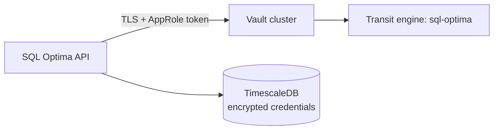

# Vault Transit — Production Operations Guide

<!-- Author: Ravi Sharma -->
<!-- Copyright (c) 2026 Ravi Sharma -->
<!-- SPDX-License-Identifier: MIT -->

SQL Optima encrypts monitored database credentials at rest using **HashiCorp Vault Transit** (`/transit/encrypt/sql-optima`). When Vault is unavailable, the API falls back to **local envelope encryption** derived from `JWT_SECRET` — acceptable for development only, not for production.

This document is the operator runbook for **P0-7**: running Vault safely in production. See also [`SECURITY.md`](../SECURITY.md) and [`docker/.env.example`](../docker/.env.example).

---

## What the default Docker stack does

The Compose `vault` service uses **file storage** (`docker/vault-config.hcl` → `/vault/data`):

| Artifact | Location | Purpose |
|----------|----------|---------|
| Unseal key | `/vault/data/.unseal` | Auto-unseal on container start |
| Root token | `/vault/data/.root_token` | Written at first init; used by `schema-setup` / API as `VAULT_TOKEN` |
| Transit key | `sql-optima` (env: `VAULT_TRANSIT_KEY`) | Encrypt/decrypt instance credentials |

**TLS:** The bundled listener has `tls_disable = 1`. In production, place Vault behind a reverse proxy with TLS or use a proper Vault cluster with TLS enabled.

---

## Production requirements (checklist)

1. **Do not rely on the dev root token in production.** Issue short-lived tokens or **AppRole** credentials scoped to Transit encrypt/decrypt only.
2. **Back up the `vault_data` volume** (or your HA storage backend) on a schedule tested with restore drills.
3. **Never run `docker compose down -v`** on production stacks — that deletes `vault_data` and **all encrypted credentials become unrecoverable** (only ciphertext remains in TimescaleDB).
4. **Restrict network access** to Vault (private subnet / security groups; not exposed on the public internet).
5. **Enable TLS** end-to-end (client → Vault → storage).
6. **Use a HA Vault cluster** (Raft or Consul) instead of single-node file storage for availability.
7. **Rotate** root/AppRole tokens and audit `vault audit` logs.
8. **Document recovery**: who can unseal, where backups live, RTO/RPO for credential loss.

---

## Recommended production architecture



- **API** holds only a Vault token with policy limited to `transit/encrypt/sql-optima` and `transit/decrypt/sql-optima`.
- **TimescaleDB** stores ciphertext only; plaintext passwords exist in API memory during collection only.

---

## Migrating off the Compose dev pattern

### 1. Stand up production Vault

- Deploy Vault per [HashiCorp production hardening](https://developer.hashicorp.com/vault/tutorials/operations/production-hardening).
- Enable the Transit secrets engine and create key `sql-optima` (or your chosen `VAULT_TRANSIT_KEY`).

### 2. Create a least-privilege policy

Example policy (adjust path if your mount differs):

```hcl
path "transit/encrypt/sql-optima" {
  capabilities = ["update"]
}
path "transit/decrypt/sql-optima" {
  capabilities = ["update"]
}
```

### 3. Use AppRole (preferred over root token)

```bash
vault auth enable approle
vault write auth/approle/role/sql-optima \
  token_policies="sql-optima-transit" \
  token_ttl=1h \
  token_max_ttl=4h
vault read auth/approle/role/sql-optima/role-id
vault write -f auth/approle/role/sql-optima/secret-id
```

Configure the API with:

- `VAULT_ADDR` — HTTPS URL of your Vault cluster
- `VAULT_TOKEN` — **or** integrate AppRole login in your secret injection (Kubernetes secrets, systemd `EnvironmentFile`, etc.)

> The stock Compose entrypoint injects `VAULT_TOKEN` from `.root_token`. Replace that with your secret manager in production.

### 4. Re-encrypt credentials (if changing keys)

If you rotate the Transit key or migrate Vault clusters, plan a maintenance window:

1. Ensure API can reach new Vault with decrypt on the **old** key (if applicable) or restore from backup.
2. Re-save monitored instances via the admin UI (forces re-encrypt), or run an internal migration tool if provided in your release.

---

## Backup and disaster recovery

### What to back up

| Asset | If lost |
|-------|---------|
| `vault_data` volume (or Raft snapshots) | **Cannot decrypt** stored credentials; must re-enter all instance passwords |
| TimescaleDB | Metrics/alerts lost; credentials are useless without Vault keys |
| `JWT_SECRET` (envelope fallback era) | Decrypt fails for credentials encrypted under envelope mode |

### Backup procedure (Docker file backend)

```bash
# Example: archive the volume while Vault is running (prefer vendor snapshot tools for consistency)
docker compose exec vault tar czf - /vault/data > vault-data-backup-$(date +%F).tar.gz
```

Store backups encrypted, off-host, with retention aligned to compliance needs.

### Restore drill

1. Restore `vault_data` to a new volume.
2. Start Vault; verify unseal (auto-unseal file or manual `vault operator unseal`).
3. Start API with correct `VAULT_ADDR` / token.
4. Test decrypt: add a throwaway instance or hit an existing collector cycle and confirm no KMS errors in logs.

---

## Manual unseal (Compose dev / file backend)

If auto-unseal fails:

```bash
docker compose exec vault vault operator unseal "$(cat /vault/data/.unseal)"
```

Verify: `docker compose exec vault vault status`

---

## Environment variables (reference)

| Variable | Production guidance |
|----------|---------------------|
| `VAULT_ADDR` | `https://vault.internal:8200` (TLS) |
| `VAULT_TOKEN` | AppRole-derived or periodic token — **not** long-lived root |
| `VAULT_TRANSIT_KEY` | `sql-optima` unless you renamed the key |
| `JWT_SECRET` | Still required for API auth; also used only if Vault is down (avoid that state in prod) |

---

## Failure modes

| Symptom | Likely cause | Action |
|---------|--------------|--------|
| `vault sealed` in logs | Restart without unseal key | Unseal or restore `.unseal` from backup |
| `permission denied` on transit | Token policy too narrow | Fix policy; redeploy token |
| Collectors skip instances | Decrypt failure | Check Vault health; verify Transit key name |
| All instances “broken” after `down -v` | Volume wiped | Restore `vault_data` backup or re-enter all credentials |

---

## Security warnings

- **Root token in `.root_token` is equivalent to full Vault admin** — treat the `vault_data` volume as tier-0 secret material.
- **Envelope fallback** (`JWT_SECRET`) is not a substitute for Vault in production; monitor API logs for KMS fallback warnings.
- Do not commit `.env`, root tokens, or unseal keys to git.

---

## Related files

- `docker/vault-config.hcl` — dev/single-node listener and file storage
- `docker/docker-compose.yml` — `vault`, `vault_data` volume, `schema-setup` Vault init
- `backend/internal/security/kms.go` — Transit client and envelope fallback
- `SECURITY.md` — vulnerability reporting and operator hardening checklist
